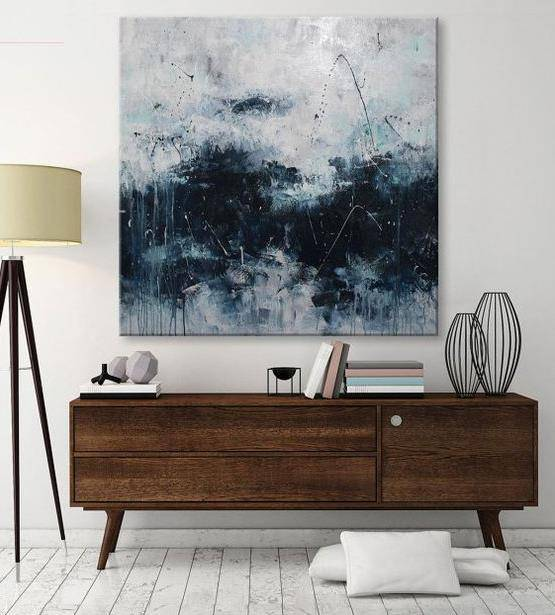
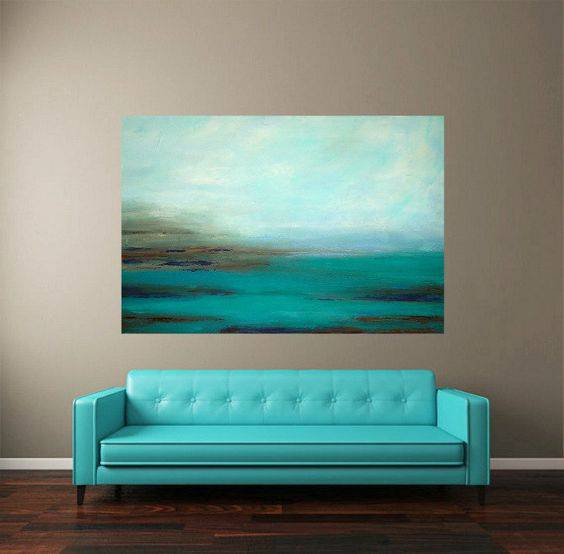
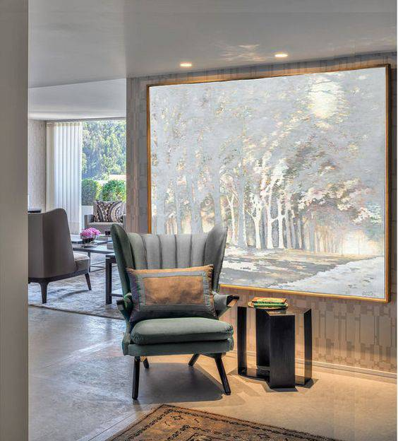
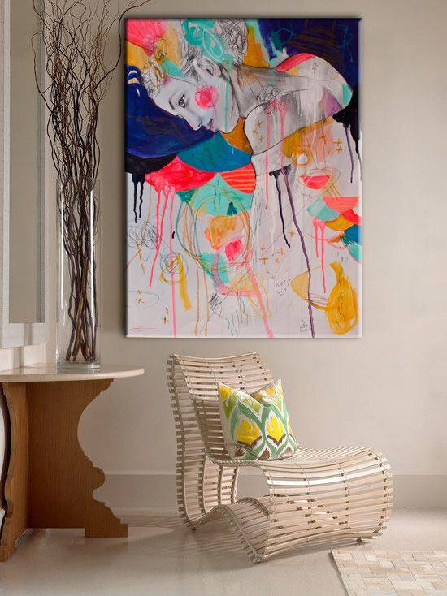
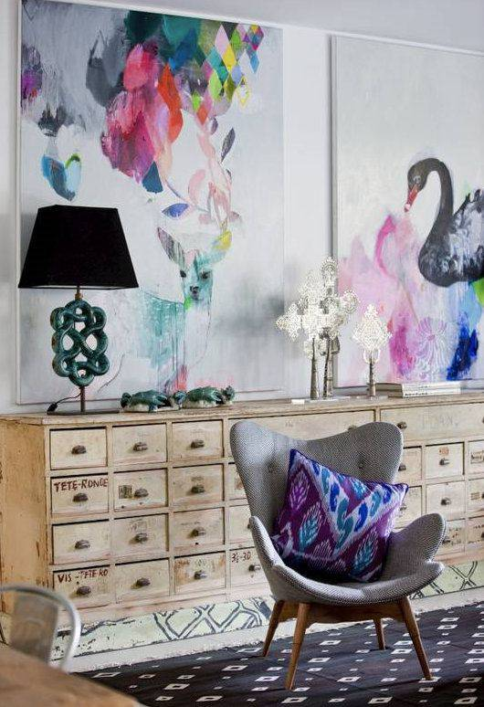
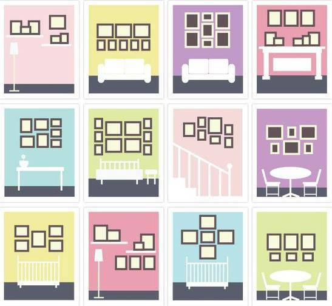

<!--
    author: 赵策明，
    head: none
    date: Sun Aug 28 22:02:04 2016
    title: 在家居软装中，全屋的装饰画布置和设计是否有好的设计理论和好的案例？
    tags: GitBlog
    category: zhihu
    status: publish
    summary:这问题开得有些大，个人来看能分为以下几个问题：**A：挂画如何和室内陈设的颜色呼应？  B：画的内容如何选？该配什么画框？以何种形式呈现？**先说第一个问题：**挂画如何和室内陈设的颜色呼应？**  * 找到家里的主色...
-->

这问题开得有些大，个人来看能分为以下几个问题：

**A：挂画如何和室内陈设的颜色呼应？  
B：画的内容如何选？该配什么画框？以何种形式呈现？**

先说第一个问题：

**挂画如何和室内陈设的颜色呼应？**

  * 找到家里的主色调，然后反复出现；这里的主色调是除去黑白灰后剩余的颜色。至于主色调的选择，可以从已有的东西入手，从已有的东西中选出一种颜色后以此为起点，来确定单个强调色（走高冷风的可以从黑白灰中选色）。

以上对应家里只有一种主色，如果家里出现双色甚至三色的主流搭配，那挂画还请从黑白灰选，谨记三色原则。

**画的内容如何选？**

**该配什么画框？**

**以何种形式呈现？**

**内容：**

  * **能选抽象画就不要选带具体内容的画**，这样和环境失调的风险比较小；

就是实在喜欢也请无框或细框。

  * **能选景物画就不要选人像画**，放个你不认识的人天天在墙上瞪着你算怎么回事？或许挂在床头能省点雨衣钱...

  * **能选明亮的画就不要选暗沉的画**，小户型要是还搞[伦勃朗*哈尔曼松*凡*莱因](http://link.zhihu.com/?target=http%3A//baike.baidu.com/link%3Furl%3DpnWueNvwmcBbZDkVxD7JzOhrT-ANlUqdL8uDzbcuM9BKNYyJ5buGJwRq-6Um4dX6MY9gtuQpG3y1tdsNGLfyGDXfvwnzwTSTMUBu_O6j_DtKPk3LOmK_tXcoAIk15AENXMpL15DhbgZuxaef-MlVr8wQgd5dej1djTIvdIVBXue)这种暗搓搓的画风让不亮的家更黑了。

最满足以上三条原则的黑白抽象帆布画，就成了安全到可以挂成半面墙的选择。

**画框**：

说起市面上的画框，简直惨不忍睹，屏幕上看着要颜值有颜值要质感有质感，到货后就能瞬间明白修图是有多神奇；有的木头接缝粗的能穿薯条；有的螺丝拧不开或拧不紧，画在
其中摇摇晃晃像在桌子上摞了 3 鸡蛋，看着生怕掉下来；想挂一副美美的画似乎都成了奢望。

**画的挂法：**

**总结：**

如有更好的见解，欢迎讨论。

[打开知乎原文](http://daily.zhihu.com/story/8686668)