<!--
    author: RED韵
    head: none
    date: Sun Aug 28 21:56:11 2016
    title: 西班牙电影《荒蛮故事》到底想告诉我们什么？
    tags: GitBlog
    category: zhihu
    status: publish
    summary:Rewind Cinema Vol.28Relatos SalvajesPrologue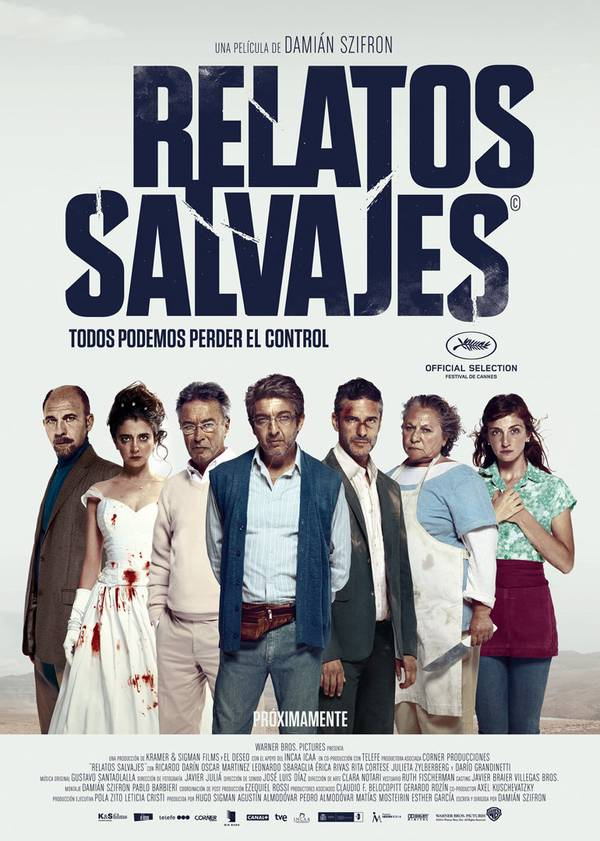观看《蛮荒故事》（Relatos Salva...
-->

Rewind Cinema Vol.28

Relatos Salvajes

Prologue

观看《蛮荒故事》（Relatos Salvajes）的体验就是一连串的"You gotta be kidding
me"，从那个短暂的劫机事件开始，六个故事在合情合理与荒谬绝伦之间的自在游走让人不得不叹服导演达米安*斯兹弗隆（Damian Szifron）的奇思妙想。但
也许你并不知道，所有的故事都是他泡在浴缸里面写就的（当然，偶尔他还会点起蜡烛、或是倒上一杯酒），他自己也说道："浴缸是个伟大的地方"。

所以想成为伟大的作家，请先去买个浴缸。（当然，有可能你先得买间放得下浴缸的房子）

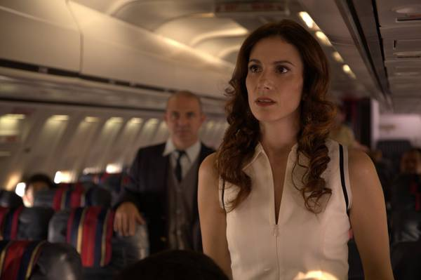

几乎每一个故事的开篇都是你我生活中习以为常或是难免会遇到的场景：飞机上一对男女的搭讪、雨夜小餐馆中迎来的一位食客、乡间公路上疾驰的一辆豪车、停车违章车辆被拖
走（当然在我国类似的违章拖车似乎并不算常见）、交通事故后的逃逸、以及几乎每人一生中都会拥有的一场盛大婚礼。但《蛮荒故事》的趣味就在于在这些看似平常的开场之后
，完全跳出寻常电影 / 叙事套路的惊人转折，以及细思之下，全然符合人性特质的情节设置。跳出套路并不是什么难事，只要具备识别出陈旧叙事模型的能力，再予以避免即
可，但撰写符合人物性格及叙事逻辑的全新故事，则是另一件事了。更何况所谓的"陈旧叙事"本就是一个充满偏见的词汇，这些"陈旧模型"之所以盛行不衰，自有其背后的根
基所在，若是抓不住深深植根在你我心中，对世间诸事的"同感"，所谓的"突破"便只会沦落为猎奇，无法取得《蛮荒故事》中全新叙事设计所带给观众的惊喜。

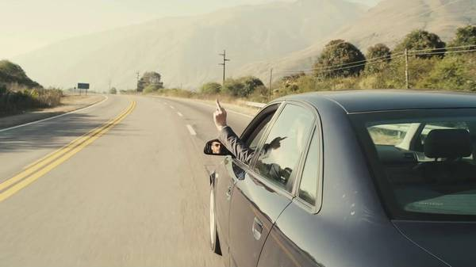

而《荒蛮故事》最大的成功，正在于他抛去了一切花里胡哨的电影技巧，结结实实地讲了六个精彩绝伦的故事。

Anthology Film

多段式电影（Anthology Film/Omnibus Film/Package Film/Portmanteau Film）并不是什么新鲜玩意，早在默片
时代这种将数个短片拼到一起组成一部长片的形式就已经很常见了，当然彼时更多是拼凑成长片以便放映，并无一以贯之的主题；其后的作品大多沿袭了这一做法，只不过会以某
个人物、某件东西、或是某个地点将这些相互独立的故事联系起来。然而《荒蛮故事》用以连缀整部电影的却并非任何一个具体的事物，而是准确抓住了这一类电影的创作原则：
"形散而神不散"，以"复仇"这一主题统括了整部影片。

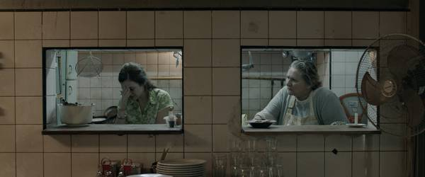

于是虽然由六个故事组成（原剧本还有第七个故事，只不过最终未能进入影片），《荒蛮故事》的观影体验却是一气呵成、无比顺畅的。六个故事的结构顺序显然经过了惊心安排
：开篇的两个故事《帕斯特纳克》（Pasternak）和《老鼠》（Las Ratas/The Rats）固然有着惊人的剧情转折，却都属于节奏较快的开胃菜：前者
只有机舱一个场景，人物看似众多，但唯一的主角却是那个自始至终从未露面、无比神秘的"Pasternak"；后者则只有餐厅和后厨两个场景，即将竞选市长的高利贷者
、丽塔 • 寇蒂丝（Rita Cortese）饰演的后厨大妈以及背负血海深仇的女侍应构成了奇异的三角关系。这种以群像讲述故事的模式以及在逐个角色之间快速跳跃
的叙事方法大大提升了故事的节奏，玩家几乎没有喘气空间，便被一个接一个精巧转折刺激地喘不过气来。

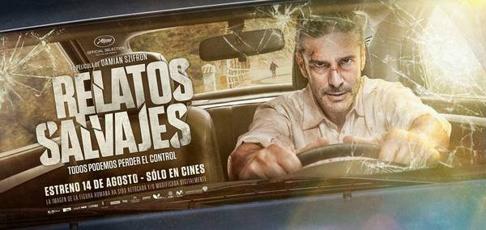

居中的两个故事《最强者》（El mas fuerte/The strongest）和《小炸弹》（Bombita/Little bomb）在情节与人物的复杂度
上均有了明显的提升，但已经不再使用群像展示的模式叙事，而是聚焦于一两个主要人物身上：不论是前者中的司机还是后者中的爆破专家，在走到疯狂的最后一步之前，都经历
了一连串的羞辱与伤害。观众甚至能够看着他们的双眼一丝丝变红，胸中的愤怒一点点积累到极限，最终爆发出来，做出了这些看似匪夷所思，却又何尝是你我没有想象过的事情
？

最后两个故事《提议》（La Propuesta/The proposal）和《直到死亡将我们分开》（Hasta que la muerte nos
separe/Until death do us part）则将主人公置于两难的处境中，观察他们的真实反应：是要孩子的未来还是要自己辛苦攒下的积蓄；是彻底放
弃婚姻与爱情，还是忍辱负重、勉力维持？在最后一刻到来之前，观众似乎永远想象不到一个称得上"想当然"的结局，因为决定故事走向的已经不是你我所熟悉的好莱坞式套路
，而是称得上"极端真实"的人物心理变化。

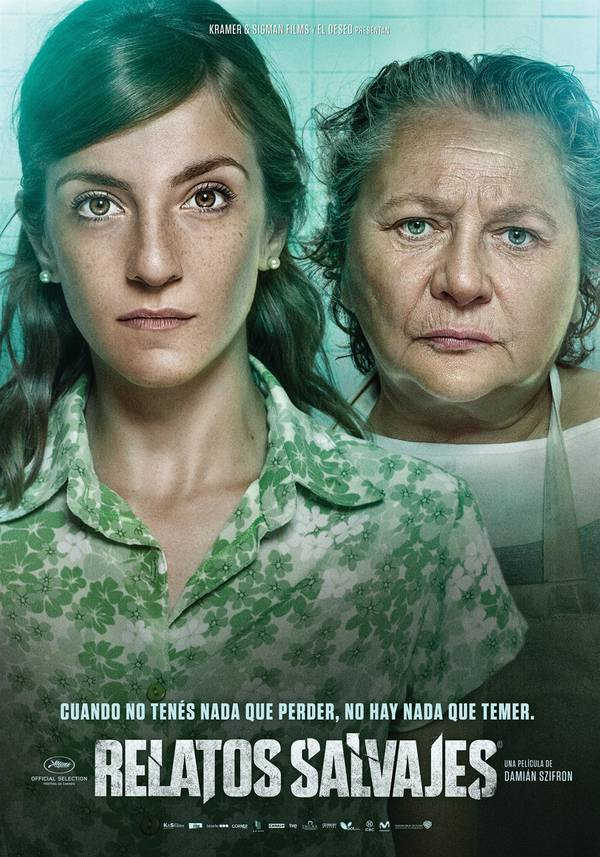

六个故事相互独立，但在情节复杂度以及人物的刻画上显然呈现出递进的状态：从最初的劫机事件到最后婚礼上的出轨事件，故事的荒谬程度在逐个降低，人物的复杂程度却急速
上升，《提议》中的父亲以及《直到死亡将我们分开》中的新娘两者的心理变化过程的戏剧性，几乎让人拍案叫绝。

Vengeance

之所以能够做到这一点，与作者对"复仇"这一心态的细致描绘分不开。"复仇"几乎足以与"性欲"并列为驱动人类极端行为的本能，但相较后者能够通过符合社会规范的正常
人类活动（恋爱、婚姻）得到解决，"复仇"在现代社会却成为了一种禁忌，我们再也看不到西部电影中正午时分镇中心大街上的拔枪对射，毕竟复仇的代价往往高到没有人可以
承受。然而也正因几乎彻底脱离了正常生活的范畴，却仍在人们的本能中占据极为重要的一席之地，"复仇"成为了文艺作品最为钟爱的题材，毕竟现实生活中做不到的事情，才
会勾起我们的好奇心。而这种本能冲动的释放，也成为了文艺作品的功效之一，人们通过观看复仇的故事，将自己代入为文学或电影作品的主角，在酣畅淋漓的复仇过程中将生活
中积累的一口恶气彻底发泄出来。

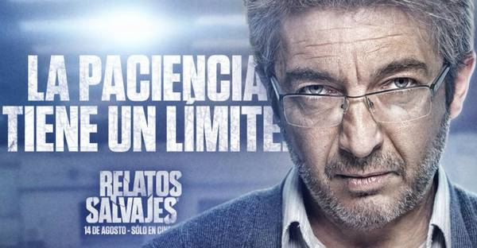

《蛮荒故事》与大多数讲述"复仇"故事的作品不同点便在于其对这一题材的另类处理方式，与依从观众喜好去夸大"复仇"快感的常规叙事理念全然相异。其对"复仇"的关照
并非完全站在正面的角度，当然亦非纯粹的否定，而是站在一个观察者的立场上，揭示驱动复仇者的本能、展示复仇者的行动及其后果，并在这一过程中展示出人性本能乃至人生
本身的荒谬。换言之，《蛮荒故事》不仅就"复仇"这一主题进行了常规的描绘（《帕斯特纳克》展示的将复仇者与复仇行为两者的剥离后的夸张复仇方式、《老鼠》中对于复仇
行为正当性的暗示）；还对这一主题进行了解构，通过对复仇者的下场描绘，展示了这一行为本身的非理性（《最强者》中由最常见的公路争执引起的你死我亡）以及整个社会的
非理性（《小炸弹》中复仇者得到整个社会的赞赏）；勾勒出面对复仇时人类恐惧与推脱责任的态度（《提议》中被复仇者在推卸责任时的勾心斗角）；并进一步讨论了勾勒了人
生本身的荒谬（《直到死亡将我们分开》中新婚夫妇的迅若闪电的决裂与复合）。

Black Humor

融在这部作品血液中的，是一种对于人类本能的关照，在你我所处的社会中，"复仇"的欲望永远处于一种被严格压抑的状态，但这并不意味着其会自行消泯，虽然通过提升自己
的素养，可以在很大程度上以理性缓解这一本能，但之所以称其为本能，正在于其非理性的本质。一味地按照现代社会的行事规则，并不意味着你能够过好自己的人生，因为社会
并非理想中的那样公平，当我们遭遇不公乃至迫害之后，如何对待自己的"复仇"本能？

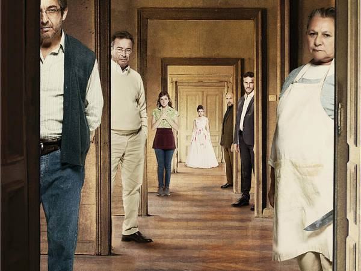

《蛮荒故事》所展示的，正是人类面对这一困境时的不同应对方式，以及荒谬绝伦的结构，而在这一群像展示背后的，其讨论的却不仅仅是复仇，而是暗暗指向了造成这一困境的
社会体制乃至贫富差距。《帕斯特纳克》中音乐教授对帕斯特纳克音乐梦想的冷漠取笑、《老鼠》中的高利贷者对女侍应一家的残酷迫害、《最强者》中两位司机之间显而易见的
贫富差距、《小炸弹》之间爆破专家与拖车公司乃至其背后腐败体制的矛盾、《提议》中富有的肇事者与显然处于工薪阶层的被害者、《直到死亡将我们分开》中这一对新婚夫妇
背后的家族关系等等，几乎每一个故事中的复仇者与被复仇者，都处于一种不对等的关系，驱动复仇者行动的并非仅仅是针对被复仇者的仇恨，更是他们对于被复仇者所代表的阶
层、利益的仇恨。

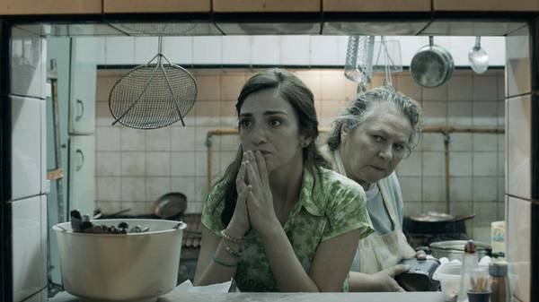

在这一层面思考，便能体会到故事中每一个主人公的真正困境所在，他们所面对的并非仅仅是个人之间的仇恨，而是整个体制的不公，但体制与社会阶层本身，却又并不是一个可
以复仇的实体对象，于是只有将这份不甘与仇恨发泄到代表着对立阶层的个体身上。《老鼠》中的后厨大妈与高利贷者之间并没有任何直接的迫害关系，但她却是痛下杀手的那个
人，真正与高利贷者有着血海深仇的女侍应却在试图拯救他，通过这一奇妙的反差，影片已经暗暗点出了"复仇者"与"复仇对象"之间的错位。《提议》则更是将这一错位置于
故事的核心转折上，复仇者最终并没有成功向肇事者实施复仇，甚至也未能向任何一个高层社会的人复仇，而是伤害了与自己同处于社会底层的人。虽然《小炸弹》中的复仇虽然
未能伤害任何一个人更将爆破专家自己送进了监狱，却导致了拖车公司存在合理性被整个社会质疑，但也不过是误打误撞，他自己不过是完全凭借本能去复仇。

在错位与误打误撞的混合中，《蛮荒故事》点出了面对社会时个体的无助与茫然，人们要么相互伤害，要么只能盲目地复仇，却没有任何可以直接改变社会的办法，这也恰恰切合
了复仇本身的非理性。复仇这一人类本能自身的矛盾与趣味也便在此，一方面人类依赖其去改变自身的处境，缺乏这种非理性欲望的驱动，人们便无法做出任何行动，也便不可能
对社会的不公进行宣战；另一方面正是由于这种非理性，每一次抗争似乎都偏离了其真正的目标，伤害到了周围的人，即使是正中了靶心击溃了体制，也完全是无心插柳。在这一
过程中，社会的荒谬、人性的自相矛盾被展示的淋漓尽致，观众能在看完这部影片之后，在欢笑的同时也自然会感受到主角那种种不甘与迷失。

Exotic

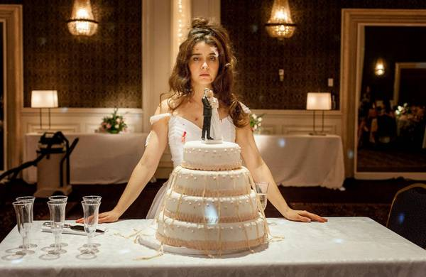

南美在这部影片中是一个非常重要的背景元素，对于大多故事而言，敢爱敢恨、热烈奔放的区域民族性格不仅放大了人类的本能、确保了每一次复仇的执行，也同时给影片带来了
一股浓浓的异域风情（当然，这种异域风情是对南美影片不熟悉的观众而言）。与复仇相伴相生的自然是贯穿整部作品程度较高的暴力展现，在《最强者》中这一特征抵达了极致
，两名车主的死斗几乎堪比一部动作大片。然而即使在这种激烈的动作戏里，你也能够看到浓浓的黑色幽默，壮汉车主最后努力想要吹熄加油口点燃的抹布那一幕，实在是让人忍
俊不禁。

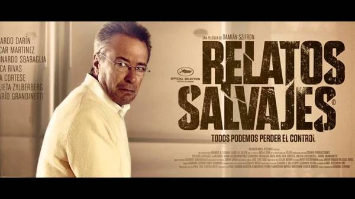

暴力与幽默的混合为影片涂上了一层别样的乐趣，将纯粹暴力带给人的本能反感消解于无形，在这层混合背后的，也自然与南美各民族文化中对于死亡的戏谑与轻松态度脱不开关
系。死亡在其眼中并非一切的结束，而是另一段生活的启程，随着基于南美文化的作品越来越多地出现，更多的人开始熟悉这一文化传统，如果你看过《生命之书》(The
Book of Life)这部动画长片或是玩过《墨西哥英雄大乱斗》（Guacamelee!）这部游戏应该会更有感触。

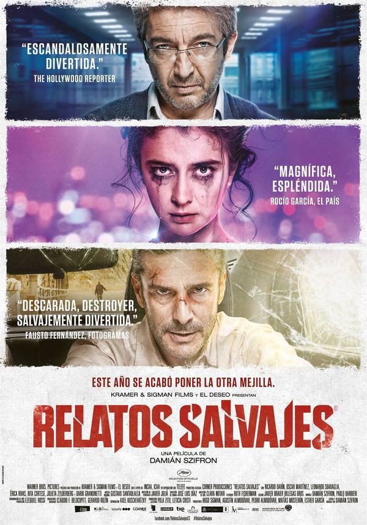

对生死的轻松态度，将这部作品从复仇的严肃性中解放了出来，主角们不再吟诵着"To Be or Not To Be"踯躅不前，而是将许多我们日常生活中感想而不敢
做的事情都做了出来，影片将主角们从寻常社会的规则、生死观中解放了出来，但这一处理的根基是植根于南美洲的民族性格之中，也就不显得突兀与牵强了，更有趣的是，影片
并没有停在这里，而是抵达了轻视生死的背面，对生活本身的热爱。之所以《直到死亡将我们分开》会成为影片的最后一个故事，正在于对主题从背面的另一次解读，在一切复仇
结束之后，新婚夫妇突然燃起了爱欲，当着一众已经因惊吓过度而不知所措的嘉宾面前开始做爱。对死亡的藐视与对生命的热爱是一体两面的存在，在影片的结尾，一切荒谬结束
的地方，人性的另一层，那炽热的激情，终于渐渐浮上水面。

Epilogue

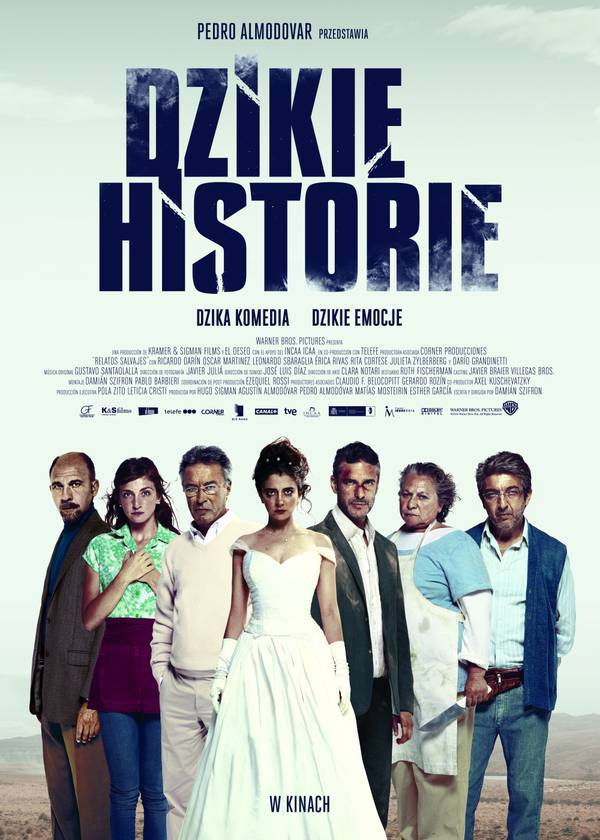

在对生命的热爱中，《蛮荒故事》缓缓落下了帷幕，现在重新看这个标题，似乎已经能够感受到蕴于其中的极致人性。在粗粝的、充满原始冲动的复仇与对社会贫富阶层差距加大
的冷静讽刺中，你仍能体会到那份对于生活本身无条件、非理性的热爱，这本身就已经是一种奇妙的体验了。藏在人类最为复杂与难以解释的冲动之下的，也恰恰是其最为可贵的
那一份同样难以用理性解释的热情。正是在这一点上，《蛮荒故事》彻底超越了一般多段式电影的小品状态，真正成为了一部值得咀嚼与反思的作品。

[Rewind Cinema Vol.28](https://medium.com/rewind-cinema/rewind-cinema-
vol-28-95a4200ee5b9)

* * *

微信公众号：一点儿也不宅

[打开知乎原文](http://daily.zhihu.com/story/8724543)