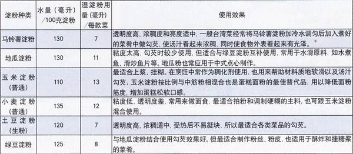

<!--
    author: 无不散席，
    head: none
    date: Sun Aug 28 22:02:16 2016
    title: 勾芡的种类有哪些？使用材料上有哪些不同？应该如何使用？
    tags: GitBlog
    category: zhihu
    status: publish
    summary:"勾芡"指在菜肴成熟或即将成熟时，投人淀粉粉汁，使卤汁稠浓，粘附或部分粘附于菜肴之上的过程。其主要利用淀粉的受热吸水糊化而达到目的。在菜肴中形成稠黏状的胶态卤汁谓之芡汁。常用粉汁有两种调制形式：1、单纯粉汁。即清水加淀粉,习惯...
-->

"勾芡"指在菜肴成熟或即将成熟时，投人淀粉粉汁，使卤汁稠浓，粘附或部分粘附于菜肴之上的过程。其主要利用淀粉的受热吸水糊化而达到目的。在菜肴中形成稠黏状的胶态
卤汁谓之芡汁。

常用粉汁有两种调制形式：

1、单纯粉汁。即清水加淀粉,习惯上称为"湿淀粉"或"水淀粉"，是使用前调制的粉汁。

2、混合粉汁。即在单纯粉汁中添加其他材料调匀，有调味、着芡两重作用,故习惯上又叫"碗汁"或"兑汁"，用于旺火速成的菜肴。

粉汁调制后需投人加热的菜肴，使之糊化成为芡汁。着芡的方法因不同菜式有泼入式与淋入式两种：

1、泼入式是将粉汁迅速泼人锅中，在粉汁糊化的同时快速翻拌菜肴，使之裹上芡汁。这种方法具有覆盖面广、受热迅速、裹料均匀的特点，有"泼芡满天雨"之称。成芡大都为
包芡。

2、淋入式是将粉汁徐徐淋人锅中，一边摇晃锅中菜肴或推动菜肴，一边淋下粉汁，使之缓缓糊化成芡汁。这种方法具有平稳、糊化均匀缓慢的特点，有"淋芡一条线"之说。一
般用于中、小火力制熟的具有一定卤液的菜肴着芡，大多数采用单纯粉汁，成芡一般为薄质芡汁。尤其是一些易碎或形体较大的原料。

常用淀粉的种类可以参考下面这个图表

但是在具体使用的时候也要注意区分，比如琉璃芡适宜选用木薯淀粉（即超级生粉），其支链淀粉含量高，黏性强，透明度高。而不推荐使用绿豆淀粉、马铃薯淀粉，它们粘性足
，质地细腻，色洁而有光泽，但吸水性差，容易懈芡。红薯淀粉虽然吸水能力强，但粘性较差，无光泽，色暗红带黑。另外木薯淀粉糊化温度为 52℃ \- 64℃
，马铃薯淀粉 56℃ \- 69℃ ，而玉米淀粉为 62℃ \-
72℃。可见木薯淀粉糊化时，所需的温度最低，而且糊液稳定透明、成膜性好、渗透性强等优良理化特性和加工特性。

而炒制海鲜和蔬菜一类的菜肴，则适合用"偷芡法"，它的芡汁非常薄，大概只有普通勾芡的 1/5 -
1/3，成菜要求看不见芡汁。关键点主要有两个：一是不论原料汆水还是滑油，一定要控净分或油分，而且制作时，锅内留油一定要少。二是--
定要采用旺火快炒的方式。对于蔬菜原料而言，如果是荷兰豆、芦笋、西芹、青笋，芡汁人概是正常勾芡的 1/4，如果是油菜、芦蒿、百合，芡汁用量大概是正常勾芡的
1/3。对于海鲜原料而言，芡汁用量基本都控制在 1/3。

另外葱烧海参需用包芡，且不宜久烧。麻婆豆腐须分 2 - 3 次勾芡等等，都是长期实践得来的结果，所以多做很重要。

最后补充一点，就是在大批量制作或者需要长时加温的情况下。黄原胶的稳定性要远远高于淀粉。

* * *

 **欢迎关注微信公众号 wubusanxi，那里的一切有关烹饪、饮食、读书、历史、科学与当下。**

[打开知乎原文](http://daily.zhihu.com/story/8729230)