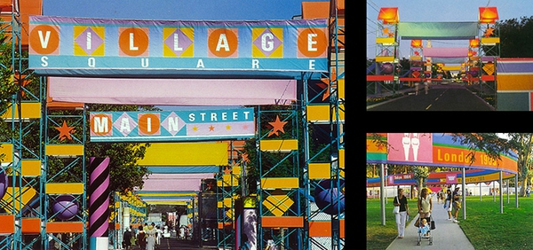
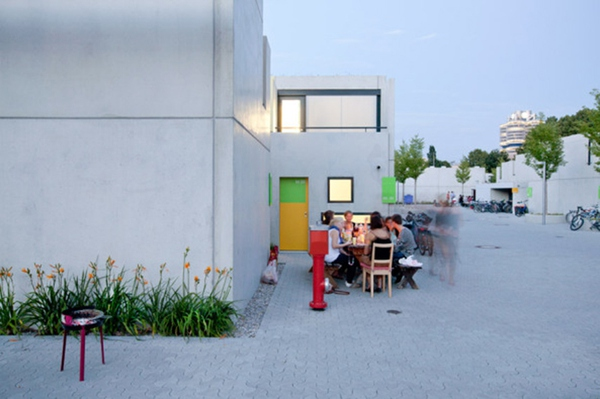

<!--
    author: XYYYY，
    head: none
    date: Sun Aug 28 21:58:26 2016
    title: 奥运遗产：“17天”的奥运村如何适用未来
    tags: GitBlog
    category: zhihu
    status: publish
    summary:到里约为止，现代奥运会举办了 51 届，这包括夏奥会和冬奥会。共有 42 座城市曾多次或单次举办过这件同属全人类的体育盛事。在这之中，世界上散落着约二十多个大大小小的奥运村。与一些后事惨淡的场馆相比，多数奥运村因具备居住属性而延续生命...
-->

到里约为止，现代奥运会举办了 51 届，这包括夏奥会和冬奥会。共有 42 座城市曾多次或单次举办过这件同属全人类的体育盛事。在这之中，世界上散落着约二十多个
大大小小的奥运村。与一些后事惨淡的场馆相比，多数奥运村因具备居住属性而延续生命。

只不过以不同的方式。有的作为商品房出售，有的成为社会福利住宅或学生公寓，有的将其作为城市改造的前戏。这件赛事的存在感，错综复杂，有人道刺激经济，加快惠民设施
的建设；也有人道成果与骇人的资金投入难成正比。今天避开综合性谈论，我想只从运动员所住公寓出发，试着挖掘这件奥运遗产在未来被延续的可能。

**真的需要奥运村吗？**

一百年前的奥委会是对这个问题争论不休的。

●_1932 年，洛杉矶奥运村。一切都是临时搭建的，奥运会结束后这个"奥运村"雏形被拆解，消失。_

其中推动现代奥运成立的顾拜旦主张"奥运城"，他认为现代奥林匹克应脱离古时城邦之战，通过运动员的友爱精神去培养国家之间的关系。

早期，运动员们睡过轮船、棚屋、兵营帐篷、学校宿舍或酒店，公认的第一个初步实现奥运村概念的是 1932
年洛杉矶奥运会，所有男运动员被安设在临时搭建的奥运村里，除了一座座独栋房屋，还有诊所、邮局、露天剧院等。

● _1932 洛杉矶奥运村运动员房间  
_

这些运动员的房子，被称为"奥运小屋"，建筑物以一种防火性佳的建筑材料速成，每个小屋容纳 4
人，都配有冷水淋浴、窗帘，甚至还有香港制造的皮草椅子，因为"足够舒适"。赛后一切都被拆除。

● _1932 洛杉矶奥运村运动元所居住楼屋的搭建过程。也是彼时泰勒主义推崇效率的一种映照。_

1932 年这个做法已基本明确了日后主办城市的两派观念：奥运村的"暂时性"与"长久性"。尽管修建奥运村是《奥林匹克宪章》的要求，但如 1984
的洛杉矶奥运会、及 1996 亚特兰大奥运会就尽量避免新建，而是基于大学校园设立奥运村。

● _1984 的洛杉矶奥运村（后 2 张为奥运会现场）。奥运村基于南加州大学等 3
所校园，并未新建，因为他们认为现有设施基本可以支撑奥运会的完成。以**带有装饰性的、临时搭建为主要办法**，这届奥运会的整体视觉也很有趣。_

多数主办城市都是新建奥运村。但对城市自身来说，做得风光体面是一部分，同时怎么把包袱变基石非常需要智慧。基于各自不同历史背景，每个城市都有多种做法和决策，非常
个体化，因此无法横向对比。但从二战后开始，基本能梳理出一个趋势：

> ● 修建奥运村同时解决住房短缺问题（如二战后 1952 年赫尔辛基、1956 墨尔本）  
  
● **意在综合性的扩张，作为城市长期规划一部分**（如 1960 罗马、1964 东京、1968 墨西哥城等）  
  
● **重新修复城市病理区**（如 1988 首尔、1992 巴塞罗那、2000 悉尼等），这是后期主要趋势  
  
* 这些趋势其实也是城市发展阶段的结果

● _1952 年赫尔辛基的奥运村，其中新开辟了一个 Kapyla 区，也意在缓解二战后住房短缺问题。赛后作为社会福利房_

● _1988 首尔奥运村，这个奥运村所在区域曾在 1960 年代因大量环境污染存在问题，也趁奥运会开发进行修缮_

● _1992 巴塞罗那奥运村现状：巴塞罗那是个好例子，奥运村所在区域原先是个残破的工业区，但靠近海滨，因此选此地重新开发，后续的旅游业和商业价值很高_

综合来看，一个成熟的奥运村基本满足两点：一，这是一个满足运动员居住、赛前练习、休憩、医疗复健、娱乐等综合性社区；二，交通便利，与比赛场馆临近。但放到整个城市
中，奥运村的后续价值无疑更重要。

下面选了个人比较喜欢的两个奥运村，从后续的**社区属性**去看看可能。

**慕尼黑：惨案过后的活跃社区**

1972 年的慕尼黑奥运会并不是个愉快的回忆，当时发生恐怖袭击，包括 11 位以色列选手在内 16 人遇难。在尚存的影像资料中，可以看到蒙面的恐怖分子翻越运
动员公寓的屋顶。也是从这届奥运会开始，往后主办国都对奥运村提升警备。不过几十年之后，这里却因年轻人和接近完整的社区化变成慕尼黑中心最温柔的一个区域。

● _慕尼黑奥运村_

慕尼黑奥运村在最初设计上，对后续的居住使用有着长远的铺垫：特建地铁站、同时所有机动交通都被转移至地下，此外**应用了气动垃圾系统**。建筑包括有露台的高层公
寓、以及中部区域大面积的低层排屋。高层公寓如今多是民用住宅，而排屋则是作为学生公寓。充足的绿化空间、无车环境，以及奥运时期沿用下来的基础设施，如今都在这里保
持了活跃度。

●_ 当年比赛时的奥运村，这些管子即气动垃圾系统，整体环境塑造得非常活跃_

●_ 如今社区感很强_

其中联排学生平房达到了最大化的效果。虽然 07 年因遭遇火灾导致部分摧毁，后来几乎原样再建。这些平房在学生手中完全变成一个极富创意的村落。每人都可以在建筑物
外墙自由创作。房屋内置厨房、浴室以及必备家具，整体色彩鲜明。可以说，这里早已成为真正建立邻里粘性的社区之一。

● _一个学生平房内部_

● _学生们创作墙面，图片来源：《 bogevischs buero 》摄影：Julia Knop  
_

● _学生们的自绘墙面_

**罗马: 主打"体育休闲方式"的社区**

再让我们回到更早一点，1960 年的罗马奥运会，则开始呈现出主办城市将奥运会划入更长远规划的考虑。 带着 1960
年代西方社会战后复苏，人们对生活有了新需求的反映----比如"体育休闲"消费的兴起，以及城市扩张。

● _1960 罗马奥运村 _

为罗马奥运村主领设计的有 Luigi Moretti， Vicenzo Monaco，Amedeo Luccichenti，Vittorio
Cafiero, Adalberto Libera 等人，尤其如 Moretti 早年设计的一系列青年中心体育馆，隐去功能性真实结构令建筑空间宛如教堂等做法
，可谓意大利上世纪现代建筑的代表人物。他们打造的奥运村，是城市都市化扩张的一部分，位于罗马北部，那块区域原先就有一些体育场馆等基础，他们的一大目的是贯彻"*
*体育作为生活方式**"的方向。

单从设计角度，罗马奥运村可以说是上世纪社区住宅建筑的一个典范。33 座楼宇统一拥有相同的外墙颜色、统一逻辑下变体的窗户结构，但实际上有 10
种建筑类型满足不同居住需要。单栋住宅间合理规划了空间、街道、绿色地等，也有住宅与底层商业街混合。

●_《 Monocle 》曾经访问了如今住在罗马奥运村里的居民。图片来源《 Monocle 》_

当时奥运村计划事后是划给政府工作人员的住房。70 年代因管辖的住房委员会解散，这里缺乏监管一度萧条和犯罪滋生。**千禧年之后，因周边如 Renzo
Piano 设计的音乐厅、Zaha 设计的 Maxxi 国家美术馆等开放，这片地区再度活跃，居住人群也发生改变。**后续的调解是有效的。

●_图片来源：《 Monocle 》_

● _《 Monocle 》记录下的如今公寓一间_

其实 08 年北京奥运会对后续力有着不小的考虑。比如在海淀的大学区兴建一些体育场馆，保证未来也发挥作用（不知如今情况如何）。奥运村是作为商品房出售，业主归投
资公司，做法总之很当代中国，房价涨了，设计上不是积极的例子。

另据称 2022 北京冬奥会的奥运村（共三个）住宅依旧主要作为商品房出售，有一个会变成度假村酒店。整个冬奥会 15.1 亿美元开支中，社会投资占了 65%
。

奥运会，包括世博会在内，这些国际性的，呈现国家实力的一期一会活动，在人类文明里看极其特殊。它们是一种共有的传统，赋予各国人共有的关注点、喜悦，是和平年代的注
脚，就像 twitter
上各色人种都支持宁泽涛一样，国家边界确实被一定程度消解。但对主办城市来说，一时荣耀之后如何保持其持续力、如何实现社会裨益最大化，必须被深思熟虑。

无论何时何地，无论是个人还是国家，得意和毛病都是一时的，必须向未来看去。

参考资料* | | housing [http://prototypes.org](https://link.zhihu.com/?target=http%
3A//prototypes.org) |

* * *

Text &amp; Editor * **XY**

(C) 原创稿件 未经许可不可转载（可关注微信公众号：studiodemo）

[查看知乎原文](http://zhuanlan.zhihu.com/p/22165752)

[打开知乎原文](http://daily.zhihu.com/story/8733663)