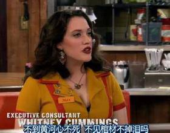
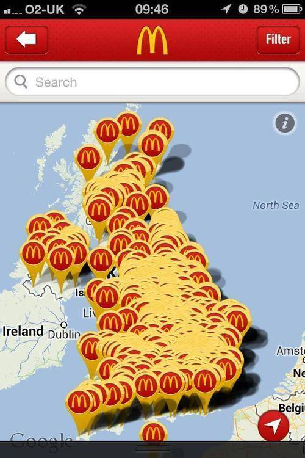
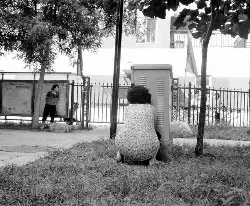
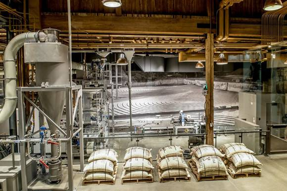
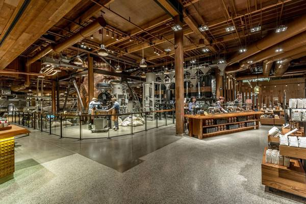
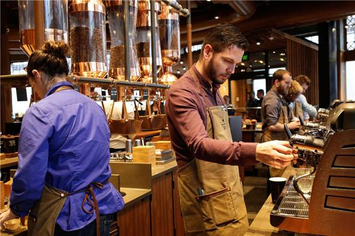

<!--
    author: 阚欧礼，
    head: none
    date: Sun Aug 28 22:01:51 2016
    title: 咖啡馆的选址要考虑哪些方面?
    tags: GitBlog
    category: zhihu
    status: publish
    summary:混迹于咖啡行业，**谁身边没倒闭个百八十家咖啡馆都不好意思出门跟人打招呼**。多深的道行都能看见有崴脚的时候，尤其在选址上，这恐怕是万里憋屈路的第一步。尤其想说：文艺控门，咖啡馆属于餐饮行业，老话儿讲是"勤"行，基本上心比天高，进来...
-->

混迹于咖啡行业，**谁身边没倒闭个百八十家咖啡馆都不好意思出门跟人打招呼**。多深的道行都能看见有崴脚的时候，尤其在选址上，这恐怕是万里憋屈路的第一步。

尤其想说：文艺控门，咖啡馆属于餐饮行业，老话儿讲是"勤"行，基本上心比天高，进来都变成命比纸薄。没抱着吃苦受累，受好几道夹缝儿气的心，最好还是谨慎为上。

首先我们要明确：**世界到底有多残酷？比你想象到的更残酷……**

题主能问出这个问题，我猜想应该是一个个人行为（非连锁企业选址行为）那么我们的关注点就会和大公司的选址完全不同，因为所有大公司的选址策略你基本都用不上，不是拿
不到数据就是没资格租赁店面,或者无法承受高昂的租金，尤其是当你看到你店面隔壁的星巴克 3.5 元 / 平米 / 天，可租给你却是 8 元 / 平米 /
天。大型连锁的议价能力万万不可小视。

首先让我们看一下**大企业选址**都有哪些**恶趣味和大道理。**

比如 7-11
会关注到人流方向，与车站的位置关系，上坡下坡（店铺尽量在上坡方向，更慢的行进速度有利进店人数转化，越是低客单价越要考虑更多的细节），STARBUCKS 钟爱
的人流集中的街角（根他们最初成功的几家店铺位置有关），城市地标性区域（跟营销推广手段有关，代表星巴克进入某个城市的闪亮登场以及即将到来的统治性地位）。再到实
用派风水，比如坐北朝南的房子，优势在于门前冬日阳光可以晒到，积雪少，而北房冬天门口的街面上雪不易化，人流被挤压到对面一侧。再到麦当劳这类数据算法：商圈级别，
人口基数,消费能力，城市可支撑几家店铺，相关物料的配送成本。

看下图，英国麦当劳分布，脑补一下为什么你不能跟麦当劳用相同的策略……

全世界知名度最高的大众餐饮连锁，成功模式的单店复制 VS 开个小店

很多人觉得照着大企业的选址策略走就可以了嘛，可实际情况是这样的，傻子都知道位置好的连锁早就占坑了，位置不好的商圈也都优先品牌餐饮，小店一个眼角都不带夹你的。
要数据分析没数据，要议价能力没议价能力，怎么办？！

**穷人选址的基本功就是----不惜力**

第一步：**选定大区域**

之前关于选址跟一个开过酒吧起过饭馆的长辈聊过，总结的特别接地气，叫做长宽高厚

街道长度：直接决定街道的流量

宽度：主街道的重要指标（别跟我扯高速路！）

小区厚度:周边人群体量（根据小区的新旧、性质以及大体的年龄分布粗估消费能力,比如咖啡馆以青壮年为主要消费人群的就不要开在养老院旁边了……）

楼层高度：楼够高，人才够多……

有人的地方才有需求，尤其是客单价越低的商业约需要靠近需求人群。

当你真正里里外外上上下下的对一个街区了如指掌的时候，那么开始后边的阶段。

周边要是以下这样，基本可以 PASS 了（流量够，年龄结构造成有效流量不够……且有效流量都绕道走了）

第二步：**蹲守攒数据**

蹲点儿是个力气活，唯一的建议是当店员表现出对你的厌恶的时候，最好点点儿东西，终究人家还要做生意，一屋子蹲点儿的翻台率就惨不忍睹了。如果附近有业态近似的馆为最
好.第一，他会帮你探出周边的市场基础，消费能力。其次，干掉他是你的第一要务，知己知彼，百战不殆。

蹲点也是个技术活，完整的资料获取需要付出足够的时间与精力.

分时段记录：工作日，假日，如果附近住主要人群为学校还需要考察学校放假时的数据

客单价 / 顾客年龄分布 / 大体职业、消费能力消费习惯 / 翻台率 / 全天的流量分布（直接决定营业时间以及排班制度）

数据分析不做详细的描述，因为如果你需要看我的这篇文字才知道怎么分析这些最常见的数据，说明你对餐饮行业的了解还不足以支撑去开店。

第三步，**排查与资本正碰的可能性**：任何一个咖啡馆都要面对的是，如果当你身边开了一家星巴克怎么办，你可以说星巴克是快餐化的，我有 400 平，提供舒适的
座椅，那么紧接着旁边开了一家雕刻时光或者漫咖啡怎么办。资本正碰的结果是压倒性的品牌优势（直接选择大品牌用户选择成本多低啊），你的进店人数减半，接着是压倒性的
财力。商超里赔钱的星巴克 COSTA 不是没有，但是主不在乎，集团作战和单兵突围不是一个路子。（比如下图这样的星巴克，你以为人家是为了单店挣钱吗？）

最后根据你活活蹲出来的周边近似业态的营业情况，估算流水，再琢磨你咖啡馆的优势劣势，推算出大体的营业额以及可承受的租金范围，再去准备好钱准备租门面吧。

商业的基础依然是需求，尤其是做为咖啡馆这类客单价并不高的地缘性消费（买个车能跑趟郊区，买个咖啡真犯不上），选址就变态的重要。没有 1
公里内市场需求作支撑，O2O
引流什么都是胡扯，黄太吉可以有慕名者从几千公里外来吃，但是靠这个人流活下去是完全不可能的。永远不要忘记需求者的时间成本同样是成本之一。

**最后还要奉劝一下，理智开店，如果蹲出足够的数据后，根本算都算不出利润，那基本只能去梦见利润了。**

[打开知乎原文](http://daily.zhihu.com/story/8733832)