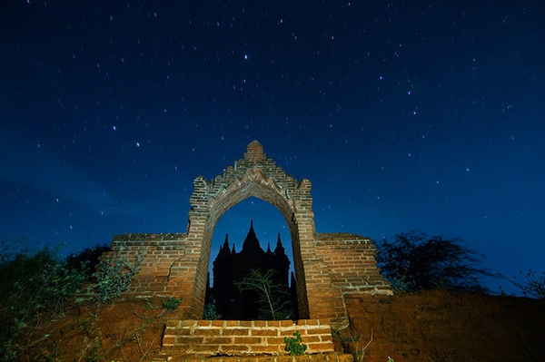

<!--
    author: 体验狮Ethan，
    head: none
    date: Sun Aug 28 22:01:32 2016
    title: 缅甸这些让人终生难忘的体验，让她绝不是“其他国家”
    tags: GitBlog
    category: zhihu
    status: publish
    summary:> 她是拥有世外桃源般海岛的佛国，是孕育淳朴民风的高原与江河，还是保留殖民地风情的、从军政府专制走向民主转型的国度。下面这九种体验，就是认识这个"非其他东南亚国家"的绝好方式。by 怡然**Vol.1 佛与人 **_**仰光大...
-->

> 她是拥有世外桃源般海岛的佛国，是孕育淳朴民风的高原与江河，还是保留殖民地风情的、从军政府专制走向民主转型的国度。下面这九种体验，就是认识这个"非其他东南
亚国家"的绝好方式。by 怡然

**Vol.1 佛与人 **

_**仰光大金寺 :**__体会它安静与喧嚣的两面_

作为仰光最值得到访之地，这座位于皇家园林西的圣山之上、高度 98 米、被黄金钻石和珠宝覆盖的大金寺主塔，是缅甸最神圣的佛塔----里面供奉着四位佛陀的遗物，
包括佛祖释迦牟尼的八根头发。它的规模之大，神圣感之强烈，甚至会让你对内心的无神主义产生怀疑。但它并不仅仅是个安静的冥想场所。除了在黎明时分能拜访到安静的大金
寺外，其他时候则有可能遇到喧嚣的受戒典礼或神奇的占卜活动喔。

Flickr: Javier Peleteiro

缅甸人相信算命，大金寺旁楼梯下也常摆占卜摊位。

Flickr: Stefan H

_**蒲甘：**__在热气球和单车上感受佛塔三千_

11 到 13 世纪期间，超过 3000 座佛塔分散在蒲甘平原地区。佛塔大多已翻新，使这个面貌保存完好的蒲甘王国遗址仍是缅甸的宗教及朝圣圣地。跟着旅游巴士和
人群去那些人气最旺的观景台看夕阳就太不土酷了：踩一辆单车，在较完好的佛塔四周转转；以及乘坐热气球在日出时飘浮于佛塔顶端才是正解。（注：热气球项目只在 10
月到 3 月开放）

蚂蜂窝：cd 淡墨

Flickr：David Min

蚂蜂窝：cd 淡墨

_**禅修中心：**__体验短期禅修_

都说禅修是缅甸特产之一，因其与泰国等其他南传佛教国家一样，盛行短期出家风俗。缅甸的南传佛教寺院或禅修中心，秉持的方法和戒律几乎是佛教的原教旨主义，似乎最接近
原始的佛教。在签证方便、时间自由、吃住免费的条件下，前往缅甸著名的禅修胜地----
位于仰光的马哈希、班迪达、恰密禅修中心，及毛淡棉市南郊的帕奥禅林等，体验南传上座部佛教的内观禅修吧。

Flickr: maris vabils

缅甸禅修过程中，有一条线索是需要观察人的累累白骨，这…

Image credit: Shwe Lan Ga Lay

**Vol.2 江湖海**

_**茵莱湖：**__悠闲乡村假期_

淳朴善良的当地人，水墨般沉静的湖水，氤氲凉爽的天气是茵莱湖的关键词。划个独木舟，围观单脚驾船捕鱼的船夫以及漂浮于湖面上的农田、市场、寺庙、花园和村庄。这些水
上建筑与湖岸边拔地而起的丛山相照应，好似天地湖都连在了一起一般。

蚂蜂窝：cd 淡墨

Flickr: scott.garfield

_**伊洛瓦底江：**__漂流而下，探幽访微_

伊洛瓦底江是缅甸的"母亲河"，在她流经的地区产生了缅甸的历史、文化与经济中心。其全长 2000 多公里，从西部山地和东部高原的沉陷地带，蜿蜒纵贯全国，最后流
入安达曼海。从北边的密支那或八莫开始，乘坐游船沿伊洛瓦底江漂流而下，穿过丛林覆盖的峡谷，探访江边的小镇村落，看江上的日出日落，会是相当难忘的经历。

Flickr: zerega

_**丹老群岛：**__坐拥上百潜点_

没有拥挤人群和潜船打扰，坐拥上百个等待潜水勇士们探索的潜点，就在丹老群岛。位于安达曼海的丹老群岛由 800
多座岛屿组成，是在海上过着游牧式自给自足生活的莫肯人的家园。长期与世隔绝，使这里的白沙、蓝海、绿浅滩显得特别纯粹。

其中最北端的黑岩岛, 拥有洁净海水与大量海洋生物，三月来潜水的话，还可能偶遇蝠鲼！

Image credit: Thinkstock

另一海岛西岩礁岛由石灰石构成，因地质作用而产生很多缝隙和洞穴，有峭壁、慢坡、礁盘和海底隧道等多种地貌。在这里，鱿鱼、乌贼、石头鱼等都很常见，外海还有可能看到
灰鲨和鹰鳐。

**Vol.3 高原与郊野**

_**卡劳：**__高原徒步_

在高达 1320 米、山脉延绵起伏、松木覆盖的掸邦高原上徒步是什么体验？打听过了，既不会产生高原反应、沿途风光甚美不说，还能结识各地小伙伴、收获晚上共睡寺庙
的特别经历。徒步路线有多种选择，其中最受欢迎的是从卡劳徒步到茵莱湖这段约 45 公里的路程，历时 2-3
天，途径乡野、村落、森林、大路、小径和铁轨，感受和油画一样儿一样儿的乡村风光。

Flickr: Jim Delcid

_**毛淡棉市：**__在"小英国"散步_

来到这里感觉像乘坐了时光机，这个曾经的英属缅甸首府还保留着昔日的繁忙海港、殖民建筑、大教堂和大清真寺，恍惚以为还是英国作家乔治*奥威尔在此居住时笔下的
Moulmein（英属缅甸时期毛淡棉的英文名字）。

Image credit: David Eimer

Flickr: Maciej Dakowicz

在它的"小英国"区域、从 Baho Rd 到 Strand Rd 的范围内徒步，可以完全感受到它不同于缅甸其他地方的异域情调。这 2.5
英里的路上，往昔的殖民地氛围依旧可见：由印度人居住的、刷着鲜艳外墙的房屋；1829 年建立的 St Patrick's
大教堂；教堂后是一片墓地，墓石上大都写着英国人的名字，有的追溯到 19 世纪；还有一座建于 1908 年的监狱，极可能是奥威尔 1931 年写小说 _A
Hanging _时的取景地。

_**曼德勒、仰光：**__窥民主改革之路_

著名的乌本桥、马哈刚大勇僧院、敏贡古塔和石阶山，是每个去曼德勒游客的必到之处。这次来玩点不一样的：观看胡子兄弟剧团演出。

卢茂和姐妹 Daw Ma Taik Kyi 在曼德勒的家中表演。Image credit: Mathieu Willcocks

胡子兄弟剧团主要由三兄弟组成：巴巴列（ 2013 年去世）,
卢茂和卢造。这三位蓄胡子的兄弟，连同剧团其他成员（多为家人）在家进行带有政治讽刺意味的英文表演。在公开演出被禁止的情况下，这个团体已经表演了 30
多年，每周七个晚上不间断。而三位兄弟中，有两位曾因对军政府持有异见而被关进监狱。

2002 年 7 月，昂山素季曾造访胡子兄弟

在巴巴列去世后，卢茂和卢造表示计划余生都继续演出，"以喜剧之名捍卫言论自由"。在曼德勒游玩不妨找天晚上去拜访他们。看完胡子兄弟表演，到仰光时记得去瞻仰一下昂
山素季女士 25 年来不断被软禁的住宅吧。

位于仰光大学附近的昂山素季住宅，No. 54 University Avenue

签证方便、机票便宜，还有如此多景点之外的绝佳体验，12-2 月就到了缅甸旅行的最佳季节（降雨少，且不热），不走一个吗？

* * *

欢迎关注知乎专栏：[一群旅行体验师](http://zhuanlan.zhihu.com/ethanlam)；微信公众号：KLOOK 旅行

[查看知乎原文](http://zhuanlan.zhihu.com/p/22196453)

[打开知乎原文](http://daily.zhihu.com/story/8734410)