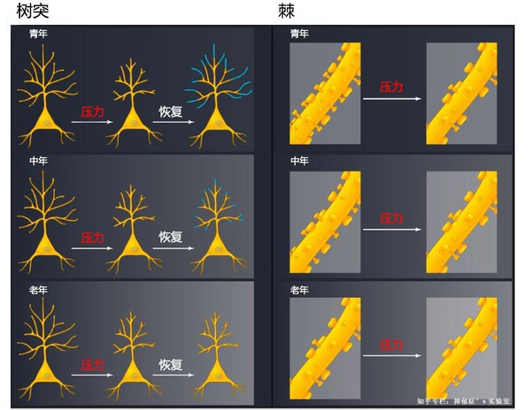
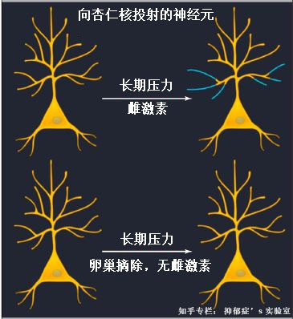
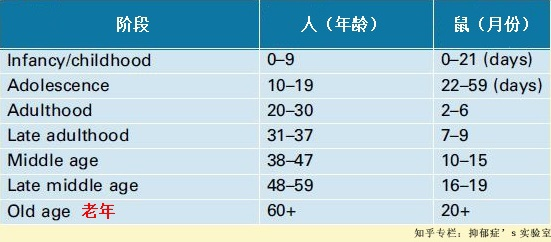

<!--
    author: Daisy，
    head: none
    date: Sun Aug 28 21:59:06 2016
    title: 面对压力，改变自己还是改变环境
    tags: GitBlog
    category: zhihu
    status: publish
    summary:面对生活中的压力或创伤事件，有些人若无其事，有些人却为此郁郁寡欢或紧张不安，甚至留下阴影。一个人能否适应环境中的应激，取决于我们的大脑调节能力，而这种调节能力建立于我们曾经的人生经历之上，尤其是早期的童年经历对我们影响很大。换句话说，...
-->

面对生活中的压力或创伤事件，有些人若无其事，有些人却为此郁郁寡欢或紧张不安，甚至留下阴影。一个人能否适应环境中的应激，取决于我们的大脑调节能力，而这种调节能
力建立于我们曾经的人生经历之上，尤其是早期的童年经历对我们影响很大。换句话说，我们的大脑随着经历不断改变，生活中的压力、创伤事件可能会导致大脑朝好的方向改变
，也可能导致大脑朝糟糕的方向改变，这也进一步导致：面对生活中的压力，我们表现出不同的应对方式。有些人心理变得更强大，有些人却患了抑郁症。

既然压力可能使我们更强大，也可能摧毁我们，面对压力，我们是选择接受压力、让环境改变自己还是改变环境呢？

**先看看压力如何改变我们的大脑**

患了抑郁症，学习、记忆能力的受损是最显而易见的。我们就拿与此有关的大脑前额叶谈谈，前额叶与我们的学习、短时记忆、自我调节等等有关，在我们的整个生命中，前额叶
在功能和结构上具有强大的可塑性。这也使得前额叶很容易受环境的影响，神经细胞之间的联系发生改变，很多精神类疾病都反映在前额叶的改变上，如注意力缺陷、精神分裂症
、抑郁症、创伤后应激等等。

应激对大脑前额叶的影响，与这种刺激的类型有关。研究发现，幼年动物面对断断续续的压力刺激，前额叶会逐渐技能 get
，做出相应调整，获得一定的自我调节和应对能力，这就是所谓的越挫越勇吧。但对于老龄动物，前额叶则表现出逊色的自我调节能力。

图一 不同年龄阶段，面对长期压力刺激，内侧前额叶皮质的边缘前区锥体神经元突触的变化，该区域与学习记忆密切相关。根据 McEwen, B.S.,
Morrison, J.H., 2013 文中图片修改。

科学家们对不同年龄阶段的老鼠进行长期应激刺激，进而观察这种应激对老鼠的神经系统造成多少损伤。图一中，神经细胞的胞体发出树突，就是图中像树枝一样的东西，将树突
放大，可以看到许多树突棘，成熟而末端膨大的树突棘是我们通常所说的突触的一部分，组成大部分兴奋性突触后膜。树突和树突棘的多少，影响了神经元之间的联系，进一步影
响了人体的神经调节。在长期压力的刺激下，不同年龄阶段的鼠的树突远端都发生了回缩。当压力停止，老鼠从应激事件中恢复后，年轻动物的树突再次生长，中年动物的树突再
生受到一定阻滞，而老年动物的树突却完全停止再生。再看看树突棘，树突棘是形成神经突触、参与神经递质信息传递的基础，在压力刺激下，较小的树突棘消失，即使从压力中
恢复过来，丢失的树突棘也没有再生。虽然中年和老年人，没有表现出更糟糕的树突棘丢失，但老龄化过程本身会进一步加剧树突棘的丢失。

很多成功指南都告诉我们，不要想着改变环境，要去改变自己。有一篇文献就正儿八经的说过，如果你已经步入老年，面对压力时，就别想着改变自己了，改变环境吧。

我们都知道，女性往往更容易患抑郁症，面对压力，心理往往更脆弱。除了年龄，我们不得不考虑到性别差异，但性别差异要复杂的多。比如在该实验中，研究者继续观察雄雌鼠
的差异，发现雄鼠脑内位于内侧前额叶皮质，参与杏仁核基底外侧核投射的锥体神经元，面对长期压力的刺激，树突发生回缩后还具有一定的恢复能力，而该部位参与其他区域投
射的神经元较易发生树突回缩，且不易恢复。对于雌鼠，只要给予雌激素处理，面对压力刺激时，该部位投射到杏仁核的锥体神经元的树突变长并增多，投射到其他部位的锥体神
经元，不管有没有雌激素处理，树突都不会发生改变。再看看没有雌激素的情况，将雌鼠的卵巢摘除（实验中，将卵巢摘除视为雌激素缺乏），在压力的刺激下，投射到杏仁核的
锥体神经元的树突不再受压力的影响。

图二给予雌激素或卵巢摘除，雌鼠面对压力时，脑内神经元的变化。根据 McEwen, B.S., Morrison, J.H., 2013 文中图片修改。

抑郁症患者脑功能区内损伤及造成的体积变化，可成为未来临床辅助诊断抑郁症的特征性指标。对具有多年抑郁症史的患者进行头部扫描，发现与学习记忆有关的前额叶和海马区
，体积都发生了改变，比其他健康人的体积小，进一步研究，发现这两个部位的树突和树突棘发生了萎缩或消失。

**大脑的改变能不能完全逆转**

压力或创伤事件发生后很长一段时间，我们又像从前一样上班下班、交友旅游，似乎身心都已经从那些创伤中恢复过来了，但我们的大脑已经不是之前的大脑。科学家对老鼠进行
了长达 21
天的（对老鼠来说，已经很长了，参考图三）慢性应激刺激，比如强迫老鼠游泳、高强度灯光频闪、噪音刺激、禁食禁水、足底电击等等。接下来停止对老鼠的应激刺激，过
21 天后，观察老鼠的焦虑行为已经消失，并完全恢复到应激前的水平。对老鼠的海马区的基因表达情况进行检测，发现和未应激的老鼠比，大量基因的表达水平已经改变。将
这些已经'恢复正常'的老鼠和其他正常老鼠投入水中，进行强迫游泳刺激，这些有应激创伤的老鼠相比正常老鼠，面对再次应激事件，海马区的大量基因存在不一样的表达。

这也告诉我们，经历长期压力或应激，即使行为上已经恢复正常，并不意味着我们的大脑也恢复到以前的样子，这些经历会改变我们的大脑，使我们对往后的应激事件表现出不同
的反应。成功指南上说着，当我们面对压力时，要改变自己，其实也就是改变大脑。

图三 科学家界定的人和鼠的年龄阶段表，看看自己属于什么年龄段？根据 Prenderville et al., 2015 文中图片修改。

**改变自己还是改变环境**

面对压力，到底改变自己还是改变环境呢？ 作为一个纯科研工作者，从脑科学研究的角度提出几点的建议。首先要对自己有较好的评估，当自身已经意识到压力较大，较长时间
内都处于身心疲惫状态，严重情况下可能会患上心理疾病甚至抑郁症，这种压力极有可能会给大脑带来不可逆的损伤，那就赶紧改变环境，不要喝着鸡汤文，喊着要改变自己了。
当然，大脑的改变是不可避免的，我们可以利用大脑的可塑性，给自己适当压力，让自己面对生活的挑战时，变得更强大。

其实，不仅仅压力或创伤事件能改变我们的大脑，不良的生活习惯也在时刻改变着我们的大脑，甚至带来严重损伤。研究发现，缺乏足够的体育锻炼、经常熬夜、由于飞行经常倒
时差等等，会造成大脑的海马区和颞叶的体积变小。昼夜节律不规则的人，往往容易发胖且认知功能会逐渐减退。对于创伤性事件导致的大脑损伤性改变，我们不能期望完全逆转
，但可以通过其他干预性治疗，使我们的大脑产生补偿性的调节机制，比如心理治疗、体育锻炼、参加社交活动以获得支持和帮助等等。

**参考文献**

Lai, K.-O., Jordan, B.A., Ma, X.-M., Srivastava, D.P., Tolias, K.F., 2016.
Molecular Mechanisms of Dendritic Spine Development and Plasticity. Neural
plasticity 2016.

Leuner, B., Gould, E., 2010. Structural plasticity and hippocampal function.
Annual review of psychology 61, 111.

McEwen, B.S., Gray, J.D., Nasca, C., 2015. Recognizing resilience: Learning
from the effects of stress on the brain. Neurobiology of Stress 1, 1-11.

McEwen, B.S., Morrison, J.H., 2013. The brain on stress: vulnerability and
plasticity of the prefrontal cortex over the life course. Neuron 79, 16-29.

Prenderville, J.A., Kennedy, P.J., Dinan, T.G., Cryan, J.F., 2015. Adding fuel
to the fire: the impact of stress on the ageing brain. Trends in neurosciences
38, 13-25.

* * *

了解更多抑郁症的神经科学知识，欢迎关注我的专栏 [https://zhuanlan.zhihu.com/depression-
lab](https://zhuanlan.zhihu.com/depression-lab)

[查看知乎原文](http://zhuanlan.zhihu.com/p/22204568)

[打开知乎原文](http://daily.zhihu.com/story/8734577)