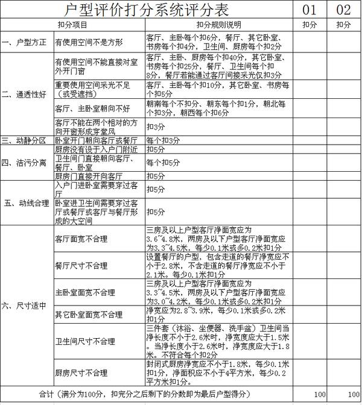
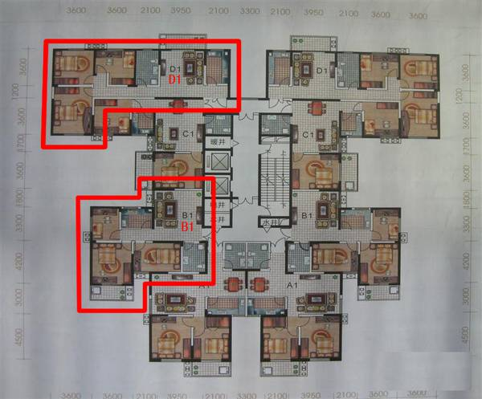
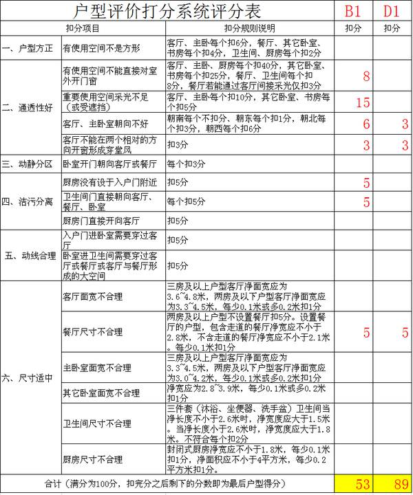

<!--
    author: 邢可，
    head: none
    date: Sun Aug 28 21:56:26 2016
    title: 怎样的房子才算户型方正？
    tags: GitBlog
    category: zhihu
    status: publish
    summary:做为一名研究户型设计多年的建筑师，我认为前两名的回答都已经很专业了。但如果是一个非专业人士，即使看了这两个回答，还是很难靠自己来对一个户型的优劣做出准确的评价。于是我根据我设计户型的经验，做了一个户型评价打分系统。每个没有任何专业...
-->

做为一名研究户型设计多年的建筑师，我认为前两名的回答都已经很专业了。但如果是一个非专业人士，即使看了这两个回答，还是很难靠自己来对一个户型的优劣做出准确的评
价。

于是我根据我设计户型的经验，做了一个户型评价打分系统。每个没有任何专业知识的人，都可以根据这个打分系统来给一个户型打分，最后根据户型的得分，可以对该户型的优
劣得出一个定性的评价，或者根据多个户型的得分对比，选出最好的户型。下面我简单介绍一下这个打分系统。

本户型评价打分系统根据以下几个方面对户型进行评价和打分：

1\. 户型方正

2\. 通透良好

3\. 动静分区

4\. 洁污分离

5\. 动线合理

6\. 尺寸适中

本户型评价打分系统采用扣分制，满分为 100 分，按每项的扣分规则扣完分之后，剩下的分数即为最后的户型得分。

所有的扣分值我都经过仔细权衡，我认为这是符合各个评价项目的权重的，各位如果觉得有不合理的地方也可以留言提出，我会认真听取大家的意见并进一步改进这个打分系统。

我已经将打分系统制作成一个评分表，方便大家使用，每一个扣分项的扣分规则在表里都有详细说明，详见下表：

下面用某地产公司的户型图举例说明。

以上平面图为上北下南朝向。如图中圈出的 B1、D1
两个户型，同一小区，同一楼层，面积也基本相同的两个户型，如果售价也一样，该如何比较这两个户型的优劣呢？先从一个建筑师的经验进行感性判断，B1
户型暗卫生间，客厅采光差，且有西向房间，基本上属于三流档次的户型，应该不如 D1 户型好。然后我们再用上面的表格进行定量分析，对两个户型打分如下：

从打分可以清楚判断，B1 户型仅得到 53 分，属于不及格的分数。D1 户型有 89 分，是较良好的一个户型。D1 户型要远远优于 B1
户型。而大家从扣分项可以自行分析到底 D1 户型比 B1 户型好在哪里。

本户型评价打分系统参考了赞同数前两名的[金硕](https://www.zhihu.com/question/19669880/answer/2312406
2)和 [Hope Chen](https://www.zhihu.com/question/19669880/answer/23196587)
的回答，特此鸣谢！

[打开知乎原文](http://daily.zhihu.com/story/8734899)