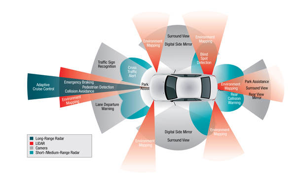

<!--
    author: xinhe sun
    head: none
    date: Thu Mar 23 00:27:02 2017
    title: 中国的自动驾驶技术发展怎么样，与美国有多大差距？
    tags: GitBlog
    category: zhihu
    status: publish
    summary:我认为，**自动驾驶是早晚的事，现在看来，自动驾驶的普及速度比预想的还要快。**自动驾驶一旦大规模普及，很多功能将会成为现实，比如：车辆可以像动车一样编组运行以实现同步高速度的交通，车与车之间的通讯和交互可以实现高效的通行效率和极低...
-->

我认为，**自动驾驶是早晚的事，现在看来，自动驾驶的普及速度比预想的还要快。**

自动驾驶一旦大规模普及，很多功能将会成为现实，比如：车辆可以像动车一样编组运行以实现同步高速度的交通，车与车之间的通讯和交互可以实现高效的通行效率和极低的事故率，甚至不需要红绿灯及各种复杂的交通标志标线系统，总体的交通效率和安全性将大大提高，是革命性的。

用不了多久，就会有人说："开车这么危险的事情，以前竟然让人去做，这简直太吓人了，不可想象。"，当然"女司机"这个说法可能也要退出历史舞台了。

很多朋友担心交通基础设施以及法律责任等问题，我觉得这点不用太担心，自动驾驶普及的过程，也是相关的交通技术设施和法律不断完善的过程。

今天主要分析一下自动驾驶的技术层面，其他相关的道路设施及法律责任等问题在这里不讨论了。

首先简单说一下**自动驾驶的原理**。

所有的控制系统都是由传感器、控制器和执行器组成的，从这个角度上讲，自动驾驶原理其实和人工驾驶是一样的，我们用眼睛观察路况，而自动驾驶则是使用激光雷达、超声波雷达、摄像头、GPS
等传感器来观察路况确定位置。我们用大脑做判断，自动驾驶当然就是用电脑作为控制器来判断。然后我们通过手脚控制车辆方向盘、加速和刹车，自动驾驶也是根据电脑的输出直接去控制车辆。

看上去很简单，但是要深入分析的话，特别是汽车这么危险的东西，要想保证自动驾驶的可靠性的话，其实非常复杂。

**传感器方面**，激光雷达和超声波雷达当然都是用来测距的，理想状态下车辆可以探测到周围所有的障碍物并算出这些障碍物的距离，但是实际上，这些障碍物很可能会被误判，比如风中飞舞的塑料袋会被判断为障碍物，甚至雨滴有可能被认为是障碍物。摄像头更不用说了，单目或多目摄像头利用计算机视觉让自动驾驶汽车实时识别交通信号灯、交通标志、车道线、近距离低速障碍物等，同时加上与道路基础设施以及云端数据库的通信，实现诸多功能。但是，今年特斯拉自动驾驶出现的死亡事故很大程度上与摄像头有关系。在逆光和大光比的情况下，摄像头的分辨能力就降低了，当然还有低照度情况，这个受限于当前的图像传感器技术，懂摄影的朋友都会知道，机器视觉本来就是一个复杂的东西，同时摄像头有可能被灰尘、眩光等各种不利因素影响，所有从可靠性上讲，依然存在很多问题。当然除了这些判断路况的传感器，汽车还有车速、加速度、转角度等各种传感器。

**控制中心方面**，接收这么多传感器的信息，进行分析处理，得出控制策略，下达控制指令，并且这个过程必须实时，所以控制中心必须具备高性能的实时运算能力。就硬件来说，自动驾驶的过程可容不得死机，所以一般硬件都要用满足高可靠性高性能的实时运算。就软件来说，算法就太重要了，自动驾驶的软件算法必须实现路径规划、躲避障碍物、加速度控制、姿态控制等等多种功能，但是目前并没有哪种控制方式能实现完美的无人驾驶，很多时候厂家都会采用多种方式共同处理，比如模糊控制配合遗传算法、深度学习等等。作为也写了好多控制软件的答主来说，感觉这句话说的真是太对了："99% 的情况使用 1% 的代码就可以应付，而剩下的 1% 的情况需要用 99% 的代码去处理。"

**执行器方面**，一旦得到了控制指令，让汽车去执行，这一部分就目前来说还算是不错的，特别是电动车。电动机极高的效率、优良的调速性能、宽泛的调速区间决定了电动车更容易实现自动驾驶，而普通汽车经过多年的发展，其发动机自动控制系统、自动变速箱、电子制动等系统的控制也已成熟，ESP、TCS、定速巡航、自适应巡航等系统也已经广泛使用，与自动控制系统对接并不麻烦。

下面说说我国的无人驾驶研究情况和美国的研究进展情况，然后看看差距。

**国内**

国防科大早在 1992 年成功研制出中国第一辆真正意义上的无人驾驶汽车。2007 年，与一汽共同研发红旗无人驾驶车，该车主要使用 CCD
图像传感器和激光雷达作为传感器，实现了高速路的无人驾驶。2011 年国防科大自行研发的 HQ3，实现了从长沙到武汉 286 公里的路试。

吉林大学研发了 JLUIV-1 型无人驾驶车，使用的是模糊控制加遗传算法修正的方式。

上海交大在 2005 年就与欧盟合作 Cyber C3 项目，研究面向城市环境的区域交通智能车辆。

2012 年，军事交通学院的"猛狮三号"，配备 5 个雷达，3 个 CCD 图像传感器，1 个 GPS，以无人驾驶状态行驶 114 公里，最高时速
105km/h。

2016 年，北京理工大学设计了一款无人驾驶赛车，使用了双目摄像头用于行人侦测、避障这样的局部路线规划。有意思的是，这车百公里加速仅 3 秒。

2013 年，百度也开始搞自动驾驶汽车，2015 年 12
月初，百度无人驾驶汽车在北京进行全程自动驾驶测跑，实现多次跟车减速、变道、超车、上下匝道、调头等复杂驾驶动作，完成了进入高速到驶出高速不同道路场景的切换，最高时速达
100km/h。下图就是百度的无人驾驶车。

今年 9 月 1 日，百度宣布其获得美国加州第 15 张无人驾驶测试牌照。百度在无人驾驶方面投入可谓巨大，包括建立硅谷研发中心，联合福特公司投资激光雷达厂商
Velodyne  (为谷歌提供激光雷达)，早前百度还公布了其"三年商用"、"五年量产"的目标。

国内刚刚起步的无人驾驶技术研究是成为很多高端人才的关注点，前面说的北理工搞无人驾驶车的负责人姜岩，和原 Intel
中国研究院院长吴甘沙一起成立的驭势科技，就是一家专门从事自动驾驶研究的公司，在双目视觉方面有着深厚的技术积累，提供低成本纯视觉的自动驾驶解决方案，在限制性环境的自动驾驶技术方面取得了相当的进展。当然类似的小公司还有很多，从不同的层面对自动驾驶技术展开研究。

以上使用的技术基本上都是以 CCD
图像传感器、雷达测距等技术，简单的高速路况下，几乎都已经可以实现不错的自动驾驶性能，但是城市道路路况，问题还是非常多，毕竟总体来看，国内的自动驾驶依然处于起步阶段，还处于研发的原型验证阶段，与美国差距不小（不光自动驾驶，很多方面都是）。百度在这方面算是国内的领头羊的，与
NVIDIA
合作，同时也和政府联手推动自动驾驶技术。但是从路试距离上来说，百度相比谷歌也差得远。类似驭势科技这种专业公司的出现，也为国内的自动驾驶研究增添了一支强劲的力量。

**美国**

**当然最牛最有代表性的就是谷歌和特斯拉。**

谷歌在软件方面一直就是世界最顶尖的，虽然微软和苹果可能表示不服气，但是我是这么认为的。

所以谷歌的强大优势就是软件和算法。下面就是谷歌的自动驾驶汽车。

谷歌的自动驾驶汽车具有 GPS、摄像头、雷达和激光传感器，可以以一个 360 度的视角从周围环境中获取信息，从 2009
年开始，谷歌自动驾驶汽车在自主模式下已经行驶了 120 多万英里，软件已经知道了许多如何去应对不同情况的方法。下图就是谷歌自动驾驶汽车眼中的世界。

从图中可以看出车身的各种传感器可以检测到最远达两个足球场那样范围内的物体，包括人员，车辆，建筑区，鸟类，自行车等，这辆车可以看到其他的车辆，这些车辆在图里用紫色的图形来表示，骑自行车的人会用红色标出，左上角转角的地方会用橙色的圆锥来表示。它甚至可以识别交警的手势，这是非常了不起的，也是谷歌强大的软件算法能力的体现。虽然谷歌的自动驾驶汽车可以根据收集到的数据来预测很多事情，比国内的强大许多倍，但是仍然会出现以前从来没有发生过的情况。有一次，一辆测试中的自动驾驶汽车正行驶在山景城地带，出现了一个坐着电动轮椅的女人在路上转圈圈地追赶一只鸭子，但是这辆车却只能不断试探并且降速来躲避这个女人。

**特斯拉**强大在别人还在研究试验的时候，它已经量产并大规模投入使用了。

作为纯电动，特斯拉在自动驾驶方便本来就具有优势，同时特斯拉又特别执着于自动驾驶技术。目前跑在路上的特斯拉车型，实现 Autopilot
辅助驾驶使用了围绕在车身周围的 12
个超声波传感器识别周围环境、一个前置摄像头辨别前方物体、一个前置雷达也对前方物体进行识别，还有就是长时间路试积累来的高精度卫星地图。这样实现了下表中的"部分自动驾驶"功能。

而特斯拉在今年 10 月 20 日非常激动的宣布：从今天开始，所有在工厂生产的特斯拉车型----包括 Model 3 ----
将配备具有全自动驾驶功能的硬件，相比人工驾驶，新硬件将从根本上提高车辆行驶的安全性。该系统将包含 8 个摄像头，覆盖 360
度可视范围，对周围环境的监控距离最远可达 250 米。除此之外，车辆配备的 12
个超声波传感器完善了视觉系统，探测和传感硬、软物体的距离接近上一代系统的两倍。增强版前置雷达通过冗余波长提供周围更丰富的数据，雷达波可以穿越大雨、雾、灰尘，甚至前方车辆。为了更好的使用这些数据，车辆搭载了比上一代运算能力快
40
倍的处理器，运行特斯拉基于深度神经网络研发的视觉系统、声纳与雷达系统软件。综上所述，该系统提供了一幅驾驶员用眼睛无法触及的世界影像，通过波段同步检测车辆周边每一个方向，这一切远远超越了人类的感官。

特斯拉把传感器布满了全车。8 个摄像头提供 360 度的视觉监控，最远能够监控 250 米范围内的物体，12 个超声波传感器覆盖的范围是之前
Autopilot 系统的两倍。一个加强版雷达用来在雨雪大雾天气下探测前方车辆。这些硬件使特斯拉的自动驾驶可以达到"高度自动化"的程度。

另外，特斯拉路上跑的车型，都用自己的各种传感器为特斯拉的高精度卫星地图在做贡献，这一点是谷歌也比不上的，毕竟谷歌就那么几辆测试车跑来跑去，而特斯拉量产的车型都一定程度上是测试车。目前特斯拉
Autopilot 辅助驾驶的行驶里程已经达到了 2.22 亿英里（约合 3.57 亿公里）。

所以总体来看，不论是谷歌还是特斯拉，其自动驾驶技术都要比国内先进，国内要追上，还需要时日。

**有时候，****差距就是****，看着很小****，觉得一使劲就可以追上，****然后就使劲****，可刚要追上的时候****，目标也加速了****，差距反而****更大了。**

[打开知乎原文](http://daily.zhihu.com/story/9303284)