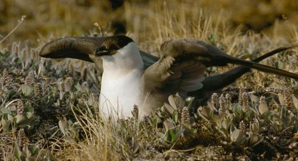
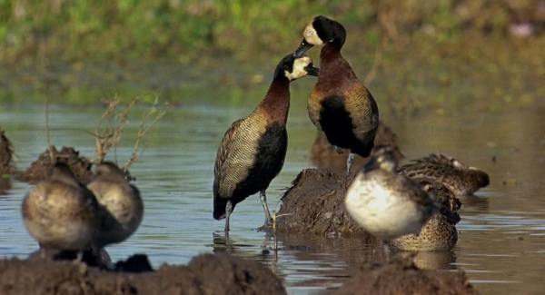

<!--
    author: 小叶叔叔，
    head: none
    date: Thu Mar 23 00:26:02 2017
    title: []
    tags: GitBlog
    category: zhihu
    status: publish
    summary:**文 / 小叶叔叔，Rbieti******引言****法国著名的纪录片导演雅克*贝汉(Jacques Perrin)"天*地*人"三部曲《迁徙的鸟》（WingedMigration），《微观世界》（Microcosmos）...
-->

**文 / 小叶叔叔，Rbieti**

****引言****

法国著名的纪录片导演雅克*贝汉(Jacques Perrin)"天*地*人"三部曲《迁徙的鸟》（Winged
Migration），《微观世界》（Microcosmos），《喜马拉雅》（Himalaya）让人深深感受到了其独特的魅力。最近又重温了《迁徙的鸟》（2003
年 75 届奥斯卡金像奖最佳记录长片提名奖）这部伟大的鸟类纪录片，再次感受了波澜壮阔的鸟类迁徙之旅，去触及了鸟类的灵魂。

影片开头，导演说到"鸟的迁徙是一个关于承诺的故事，一种对于回归的承诺"。笔者深表赞同，全世界的鸟类现在有 9000
多种，有超过三分之一的鸟类每年需要在其繁殖地和越冬地之间进行上千，甚至上万公里的长途迁徙。

每次看完这部影片都是意犹未尽，突然发现，影片好多鸟类的名字并没有标注，仅仅标注了 10
余种鸟类，而且部分翻译有误。为了让喜爱这部影片的观众能够更科学的认识本片中出现的鸟类，特写此文来梳理一下片中出现的 60
多种鸟类，让更多的人爱上这些空中的舞者。

下文介绍的鸟儿是按照影片出现的顺序，影片重复出现的鸟不重复介绍。图片来源：《迁徙的鸟》纪录片截图；繁殖地和越冬地来源：IUCN Red
List；文中鸟类中文名字，拉丁名，英文名来源于《世界鸟类分类与分布名录》（郑光美主编，2002）。

多图预警！

**春季（向北方迁徙）：**

**出场时刻：****01:16**

首先出场的是欧亚鸲（_Erithacus rubecula_），英文名 European
Robin。因其唱歌婉转多样，被欧洲人称为"知更鸟"，片中见其捕捉虫子，喂养雏鸟。欧亚鸲也迁徙，冬季在非洲北部沿海越冬，春季北迁欧洲并且繁殖。

**出场时刻：****02:33**

这个画面出现的是大杜鹃（_Cuculus canorus _）的幼鸟，英文名 Common
Cuckoo。杜鹃就是我们说的"布谷鸟"，自己不筑巢，将卵寄生在其他鸟的巢中，这个巢应该是一种苇莺的巢。杜鹃首先孵化出来，将寄主的蛋"推"出巢，这样寄主只能喂养它一只，巢寄生也是自然界一个非常有意思的行为。大杜鹃也迁徙，冬季非洲越冬，夏季飞往于欧洲繁殖。

**出场时刻：****02:53**

这个画面是灰雁（_Anser anser_），英文名 Greylag
Goose。这也是本片主角之一，最常见的一种"大雁"，影片开头有一只灰雁被一个男孩解救。从欧洲南部出发飞往从瑞典北部斯堪的纳维亚半岛，飞行 1800 英里。

**出场时刻：****03:02**

普通翠鸟（_Alcedo atthis_），英文名 Common
Kingfisher。这张大嘴天生就是用来抓鱼的。印象最深的是小学课本中的描述：披着浅绿色的外衣，小巧玲珑，又尖又长的嘴，鸣声清脆，爱贴着水面疾飞。它的窝很特别，土洞。
在国内是留鸟，在欧洲迁徙。冬季位于北非沿海，夏季于欧洲地区繁殖。

**出场时刻：****03:14**

家燕（_Hirundo rustica_），英文名 Barn
Swallow。小学课本"燕子飞回来了"，春天到了，小燕子跟着妈妈从南方飞回来了。画面是家燕的雏鸟，亲鸟一闪而过。冬季在非洲中南部，亚洲南部越冬，春天北迁至欧亚大部分地区。

**出场时刻：****06:47**

绿头鸭（_Anas platyrhynchos_），英文名
Mallard。片中与灰雁群一起飞行，这只为雄鸟。绿头鸭部分地区为留鸟，一年四季都在同一片区域，但在很多地区是迁徙的鸟，非洲和亚洲南部越冬，夏季位于欧洲和亚洲北部地区繁殖。

**出场时刻：****07:52**

灰鹤（_Grus grus_），英文名 Common Crane。世界上 15
种鹤中分布最为广泛的一种鹤。片中主角，片中越冬地为西班牙，春季北迁至欧洲，俄罗斯广泛的北方针叶林，迁徙距离为 2500
英里。片中迁徙过程中停歇在一片湿地捕食青蛙。

**出场时刻：****09:12**

白鹳（_Ciconia ciconia_），英文名 White
Stork。大型涉禽，片中主角之一。冬季位于非洲中部和南部，春季飞越撒哈拉沙漠，去往欧洲南部繁殖，迁徙距离 3100
英里。近些年研究发现，由于欧洲大量的垃圾场，提供了充足的食物，很多白鹳已经不进行迁徙，人类活动或多或少改变着鸟类的习性。白鹳没有鸣肌，不会鸣叫，只能通过敲击喙部来发出声音。

**出场时刻：****10:49**

白颊黑雁（_Branta leucopsis_），英文名 Barnacle Goose。片中主角之一，春季从欧洲西部飞往格陵兰岛，迁徙距离 1500
英里。白颊黑雁为了安全，把巢筑在悬崖峭壁上，其雏鸟刚出生就面临"跳崖"的考验，没有摔死的才能继续生存。

**出场时刻：****13:00**

大天鹅（_Cygnus Cygnus _），英文 名 Whooper Swan。片中主角之一，分布于欧洲西部南部，飞往俄罗斯西伯利亚地区，迁徙距离 1800
英里。我国东部沿海冬季也经常可见，今年 3 月初，有 30 余只大天鹅经过北京颐和园昆明湖。

**出场时刻：****13:38**

黑头白鹮（_Threskiornis melanocephalus_），英文名 Black-headed
Ibis。出现在一个牛车草垛上，一闪而过。亚洲南部的种群冬季主要分布在印度和斯里兰卡，春季北迁至印度西北和东北，我国虽然曾经分布广泛，但是近些年罕见，冬季东部沿海偶见，夏季繁殖于黑龙江。

**出场时刻：****15:12**

斑头雁（_Anser indicus_），英文名 Bar-headed
Goose。片中主角之一，也是笔者最为震撼的迁徙鸟类，冬季位于印度，孟加拉，春季北迁至中亚草原，迁徙距离为 1500 英里，途中飞跃喜马拉雅山脉。

**出场时刻：****18:16**

这张图片介绍的不是左边的大天鹅，而是右下角出现的小嘴乌鸦（_Corvus corone_），英文名 Carrion
Crow。雀形目鸦科，鸟类中智商最高的一个类群，经常偷别的鸟的蛋，而且挑衅猛禽。不迁徙，基本为留鸟。

**出场时刻：****19:11**

丹顶鹤（_Grus japonensis_），英文名 Red-crowned Crane。世界上 15
种鹤类最为优雅，漂亮的鹤只有，也是中国传统文化中非常重要的"仙鹤"，全球数量还在持续下降，可能不足 2000
只。片中主角之一，我国东部长江流域和沿海区域越冬，春季北迁至中国东北和俄罗斯西南的西伯利亚针叶林，迁徙距离 600 英里。

**出场时刻：****20:00**

这张展示不是背后的丹顶鹤，而是前面这四只雪地上奔跑的岩鸽（_Columba rupestris_），英文名 Hill
Pigeon。一种鸽子，和"家鸽"很像，性情比较温顺。分布于亚洲中北部大部分地区，不迁徙。

**出场时刻：****20:24**

白头海雕（_Haliaeetus leucocephalus_），英文名 Bald
Eagle。美国国鸟，曾经一度因为农药过度使用，导致其卵壳太薄不能孵化，数量急剧下降，后美国政府启动物种的野化放归的方式让白头海雕数量得以恢复，现在美国大部分地区都能看见。片中介绍，白头海雕冬季位于西部地区，迁徙至阿拉斯加，迁徙距离
1800 英里。

**出场时刻：****21:31**

加拿大雁（_Branta canadensis_），英文名 Canada
Goose。在美国分布极其广泛的雁，美国很多地方都是留鸟，这鸟战斗力很强。片中主角之一，迁徙的种群从墨西哥湾北迁往北极圈，迁徙距离为 2000
英里。片中迁徙过程经过美国西部干旱地区，在一卡车下喝水。

**出场时刻：****23:34**

雪雁（_Anser caerulescens_），英文名 Snow Goose。美国春秋迁徙季节常见的大雁之一，片中主角，从墨西哥湾飞到北极圈附近，迁徙距离
2500 英里。

**出场时刻：****25:48**

西方鸊鷉（_Aechmophorus occidentalis_） ，英文名 Western
Grebe。分布于北美洲西部地区，冬季位于美国西南和墨西哥西北部，春天迁往美国中西部和加拿大西南。䴙䴘和鸭子不同，嘴巴尖的，吃鱼，而且"轻功"很厉害，经常在水上玩"水上飘"。

**出场时刻：****27:30**

沙丘鹤（_Grus canadensis_），英文名 Sandhill Crane。15
种鹤类中数量最多的一种，广泛分布于美洲大陆，国内也有零星记录。片中可以看到黑压压一片，数量众多。从美国中部平原飞往北极圈地区，迁徙距离 2000 英里。

**出场时刻：****27:37**

黄头黑鹂（_Xanthocephalus xanthocephalus_），英文名 Yellow-headed
Blackbird。北美洲分布广泛，冬季位于美国南部和墨西哥，春季集群北迁美国中西部大部分地区。求偶季节会站于树枝头发出响亮鸣叫。

**出场时刻：****27:46**

红翅黑鹂（_Agelaius phoeniceus_），英文名 Red-winged
Blackbird。北美鸟类，大部分美国地区为留鸟，繁殖季节喜欢在湿地边上的蒲苇上鸣叫。迁徙种群，冬季位于美国西南，北迁至加拿大和美国北部。

****夏季（繁殖季）****

片中除了两种鸡形目鸟类，其他繁殖鸟都位于北极圈附近，北极圈附近夏季食物充足，天敌较少，大部分迁徙的鸟类都前往这个地区繁育后代。

**出场时刻：****28:13**

珠颈斑鹑（_Callipepla californica_），英文名 California
Quail。鸡形目齿鹑科鸟类，分布于美国西部和加拿大西南，留鸟。巢位于草丛中，片中巢被割草机摧毁。

**出场时刻：****29:56**

艾草松鸡（_Centrocercus urophasianus_），也有叫艾草榛鸡，英文 名 Sage
Grouse。鸡形目松鸡科，分布于美国西北部草原，留鸟。繁殖季节，雄性的艾草松鸡会在一片求偶场追求雌性。

**出场时刻：****33:34**

北极燕鸥（_Sterna paradisaea _），英文名 Arctic Tern。迁徙距离最长的鸟类，在南北极往返迁徙，迁徙距离为 12500
英里，夏季在北极繁殖。燕鸥类也是鸟类中寿命非常长的，而且单配制，一对"夫妻"经常白头偕老，恩爱一辈子。

**出场时刻：****34:44**

雪鸮（_Nyctea scandiaca_），英文名 Snowy
Owl。一种猫头鹰，栖息于冻土和苔原地带，捕捉鼠类、鸟类和昆虫，冬季分布于广泛的亚欧大陆北部，加拿大，春季迁徙至北极圈地区繁殖。

**出场时刻：****36:32**

雪鸮幼鸟。

**出场时刻：****35:32**

普通潜鸟（_Gavia immer_），英文名 Common Loon。一种海鸟，冬季分布于美国东西部以及欧洲沿海，夏季繁殖于加拿大北部和北极圈附近。

**出场时刻：****36:37**

长尾贼鸥（_Stercorarius longicaudus_），英文名 Long-tailed
Jaeger。海鸟，全世界广泛分布，夏季位于北极圈附近繁殖，肉食性，偶尔偷窃其他鸟的幼鸟，片中袭击雪雁幼鸟。

**出场时刻：****37:00**

大贼鸥（_Catharacta skua_）， 英文名 Great
Skua。大型海鸟，经常盗食各种海鸟的卵和幼鸟、甚至成鸟，故称"贼鸥"，片中在海面上袭击北极海鹦。

**出场时刻：****37:48**

北极海鹦 （_Fratercula arctica_），英文名
Puffin。海鸟，繁殖于北极圈附近，巢穴多在沿海岛屿的悬崖峭壁上的石缝沟中或洞穴里，喜欢集群活动，嘴巴可以衔很多鱼。

**出场时刻：****38:03**

三趾鸥（_Rissa tridactyla_），英文名 Black-legged
Kittiwake。海鸟，繁殖期主要栖息于北极海洋岸边和岛屿上，其他季节位于海洋上。在国内为冬候鸟，笔者 2016 年冬季于陕西洋县收获一次三趾鸥记录。

**出场时刻：**** 38:35**

普通海鸦（_Uria aalge_），英文名 Common
Murre。海鸟，大群营巢于悬崖繁殖，北半球分布广泛，基本在海洋生活。片中，雏鸟在出生几周之后在父母驱使下，跃入海中，开始生存之旅。

**出场时刻：****39:41**

北鲣（jian）鸟（_Morus bassanus_），英文名 Northern
Gannet。海鸟，信天翁的一种，分布于美洲东部和欧洲西部沿海，北极圈繁殖，鲣鸟对"爱情"也是非常忠贞，求偶行为及其优雅，求偶成功之后，就"相定终生"了。

****秋季（往南方迁徙）****

**出场时刻：****41:58**

蛎鹬（_Haematopus ostralegus_ ），英文名 Eurasian
Oystercatcher。鸻鹬类，繁殖于欧洲东北，亚洲中部和中国东北等地，秋季沿着海洋线迁徙，越冬于位于亚洲非洲海洋线附近。

**出场时刻：****52:00**

红胸黑雁（_Branta ruficollis_ ），英文名 Red-breasted
Goose。繁殖在欧亚大陆北部的北极冻原地带，秋季南迁，飞往东欧，黑海附近等。

**出场时刻：**57:12

紫翅椋鸟（_Sturnus vulgaris_），英文名 Common
Starling。雀形目椋鸟科，经常极大群活动。欧洲很多地区为留鸟，繁殖于欧洲北部和亚洲西北，越冬于非洲北部和亚洲中部。在全世界很多地区为入侵鸟类，比如美洲地区，美国政府规定，如果抓住这个鸟，就不能再放回野外。

**出场时刻：****1:05:06**

黑浮鸥（_Chlidonias niger_ ），英文名 Black
Tern。一种鸥类，繁殖于北美洲和欧洲，以及俄罗斯中部，冬季南迁至中美洲，非洲南部和西部。片中由于翅膀受伤，被螃蟹追赶，捕食。

**出场时刻：****1:05:41**

白鹈鹕（_Pelecanus onocrotalus_），英文名 Great White Pelican。繁殖于亚洲中部和南部等地，繁殖期经常每天会飞行到
100 km 之外地区觅食，捕食鱼类。冬季迁往非洲大部分地区。

**出场时刻：****1:07:04**

鹈鹕后面树上停歇的为普通鸬鹚（_Phalacrocorax carbo_），英文名 Great
Cormorant。非洲的这个亚种也叫白胸鸬鹚。捕鱼能力很强，主要分布于非洲中南部。

**出场时刻：****01:07::28**

黑鹭（_Egretta ardesiaca_），英文名 Black
Heron。广泛分布于非洲大陆湿地，喜在非洲为留鸟。捕鱼时候翅膀张开，形成伞状，把头蒙进伞中，很有趣。

**出场时刻：****01:07:50**

**按照从左到右：**

白翅黄池鹭（_Ardeola ralloides_）， 英文名 Squacco
Heron。繁殖于亚洲中西部，欧洲东部，秋季南迁至非洲中西部，东部分布种群为留鸟，在湿地边上"守株待兔"，等候猎物。

黑胸距翅麦鸡（_Vanellus spinosus_），英文名 Spur-winged
Lapwing。非洲大部分地区为留鸟，少数种群繁殖于里海附近，非洲越冬，它应该不会等候猎物，很快就离开了。

大白鹭（_Egretta alba_），英文名 Great Egret。全世界广泛分布，鹭科鸟类，喜欢吃鱼，在非洲为留鸟，和白翅黄池鹭一起等候猎物。

**出场时刻：****01:07:54**

红蛇鹈（_Anhinga rufa_），英文名 African Darter。鹈形目、蛇鹈科，和鹈鹕接近。非洲广泛分布，脖子像蛇一样又细又长，河中捕食鱼类。

红蛇鹈旁边还有一个小鸟，看见没有，黄鹡鸰（_Motacilla flava_），英文名 Yellow
Wagtail。雀形目鹡鸰科，喜欢水边抓虫子，尾巴经常一摇一摇，甚是可爱。

**出场时刻：****01:08:18**

长脚雉鸻（_Actophilornis africanus_） ，也叫非洲雉鸻，英文名 African
Jacana。一种生活于湿地里的水鸟，脚趾巨大，容易在水面睡莲上行走，捕捉水生昆虫。

**出场时刻：****01:09:02**

白脸树鸭（_Dendrocygna viduata_），英文名 White-faced Whistling
Duck。广泛分布于欧洲地区，留鸟，栖息于河流水库等湿地，以植物种子及嫩茎叶为主食。

**出场时刻：****01:09:11**

白脸树鸭前面蹲着睡觉的 5 只，白眉鸭（_Anas querquedula_） 英文名
Garganey。全世界广泛分布，繁殖于欧洲和亚洲北部，部分种群越冬非洲。

**出场时刻：****01:12:59**

小金刚鹦鹉（_Ara chloroptera_），英文名 Red-and-Green
Macaw。留鸟，分布于南美洲热带雨林，红、黄蓝色羽毛艳丽，大型鹦鹉，体长可以达到 90 cm，吃果实、花朵和种子。

**出场时刻：****01:12:52**

金刚鹦鹉（_Ara macao_） ，英文名 Scarlet Macaw。留鸟，分布于南美洲热带雨林，大型鹦鹉，红、黄蓝色羽毛艳丽，体长可以达到 80-90
cm，吃果实、花朵和种子。

**出场时刻：****01:13:09**

紫蓝金刚鹦鹉（_Anodorhynchus hyacinthus_）， 英文名 Hyacinth Macaw。分布于非洲热带雨林，体型巨大，可以达到 1
m，全身蓝色，由于盗猎猖獗，现在数量稀少，分布区非常狭小，喜欢吃棕榈果实。影片中从笼子成功逃脱。

**出场时刻：01:13:53  
**

照片中右上角那只，蓝翅金刚鹦鹉（_Propyrrhura maracana_），英文名 Blue-winged
Macaw。分布于南美热带雨林，身体绿色，脸部白色，由于栖息地破坏和盗猎，也是濒危物种。

**出场时刻：**01:14:07

图片下方为红嘴巨嘴鸟（_Ramphastos tucanus_），英文 名 Red-billed
Toucan。分布于南美洲，嘴巴巨大，杂食性，吃果实，种子，偶尔肉食，也是濒危物种。

****冬季（南极圈附近）****

**出场时刻：****01:15:20**

黑眉信天翁（_Diomedea melanophris_）， 英文名 Black-browed
Albatross。一种信天翁，广泛分布于南极圈附近，集群在岛上繁殖。

**出场时刻：****01:17:22**

凤头黄眉企鹅（_Eudyptes chrysocome_），英文名 Rockhopper Penguin。体型较小，50-60
cm，有一个它们拥有着"鸡冠头"，分布于南美洲，非洲南部和南极地区岛屿，数量较为丰富的企鹅，位于南极圈附近岛屿的峭壁上繁殖。

**出场时刻：****01:18:21**

王企鹅（_Aptenodytes patagonicus_），英文名 King Penguin。和帝企鹅是两种不同的企鹅，体型较大，体长可以达到 1
m，分布于南美洲，非洲南部和澳洲南部，迁徙到南极洲附近群岛集群繁殖。

**出场时刻：****01:19:26**

在王企鹅中间右边那个黑色的家伙，巨鹱（hu）（_Macronectes giganteus_），英文名 Giant
Petrel。体型巨大，经常捕杀小企鹅，南极圈附近繁殖。

**出场时刻：****01:20:06**

画面左边和右边除了王企鹅和巨鹱之外白色的鸟，白鞘嘴鸥（_Chionis alba_），英文名 Snowy
Sheathbill。分布于南极洲附近的鸟类，食小型鱼类、也经常偷取别的鸟（如巨鹱）的食物碎屑，"机会主义者"。

**出场时刻：****01:22:03**

不是前面的王企鹅，而是王企鹅后面飞过的大鸟，斑胁草雁（_Chloephaga picta_）， 英文名 Upland
Goose。分布于南美洲以及南极周边群岛上的雁，草地上吃水生植物。

看不清，啊哈，那就来张近照。

图片来源百度。

**影片结束，别忙，大家可以看看片尾还有一些精彩的鸟类。**

**出场时刻：****01:25:49**

安第斯兀鹫（_Vultur gryphus_），也有叫安第斯神鹫，英文名 Andean
Condor。分布于南美洲以及南极圈附近的大型兀鹫，和西藏藏民天葬的鸟是一个类群，喜欢吃腐肉，也是南极圈附近有名的"清道夫"。

**出场时刻：****01:26:48**

拟戴胜百灵（_Alaemon alaudipes_），英文名 Hoopoe Lark。分布于非洲北部和亚洲西南部，栖息于热带沙漠和草原灌丛地带的一种百灵鸟。

**出场时刻：****01:26:54**

白琵鹭（_Platalea leucorodia_），英文名 White
Spoonbill。大型涉禽，繁殖于亚洲大陆中部，在非洲，印度和中国华北，东南越冬。喜欢沼泽地，河滩，嘴长而直，上下扁平，在水下用喙部"滤食"。

**出场时刻：01:27:36**

欧绒鸭（_Somateria mollissima_），英文名 Common
Eider。一种迁徙的海鸭，繁殖于北美和欧洲北部海洋线，冬季稍微南迁，也是沿着海洋线分布。

**谨以此文献给喜欢这部纪录片的朋友们！**

[查看知乎原文](http://zhuanlan.zhihu.com/p/25901496)

[打开知乎原文](http://daily.zhihu.com/story/9304536)