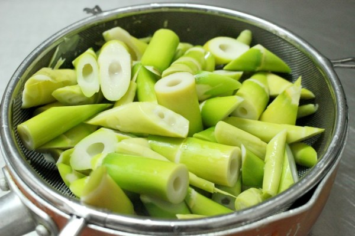
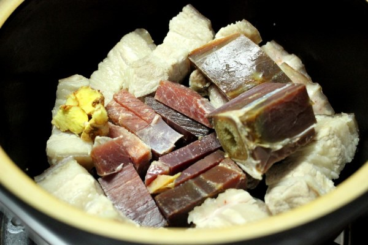
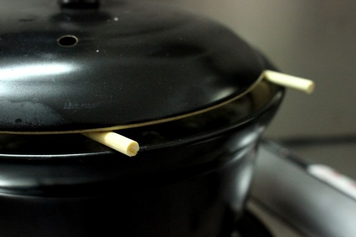
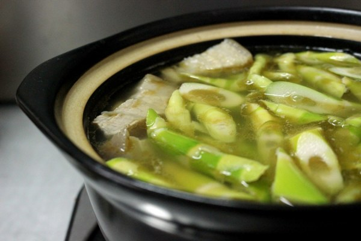
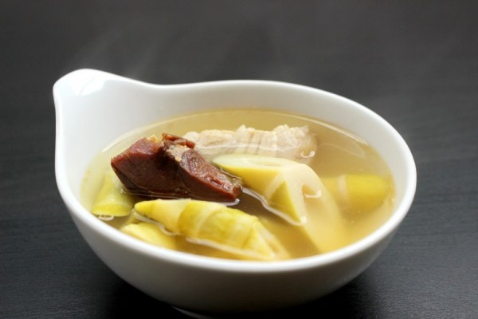
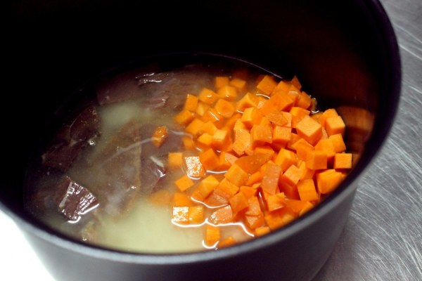
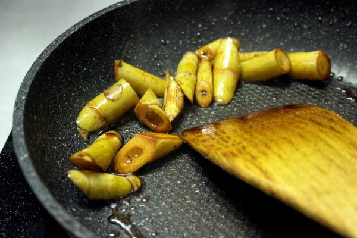
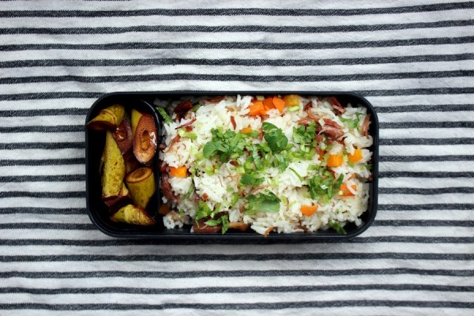

<!--
    author: 伊斯特艾格，
    head: none
    date: Thu Mar 23 00:28:17 2017
    title: []
    tags: GitBlog
    category: zhihu
    status: publish
    summary:朋友告诉我，他们那儿刚下了雪。然而对南方的朋友来说，春天已经触手可及----早在一两周前逛菜市时，就已经能看见几处摊贩摆出了春笋。现在托大棚菜的福，冬天围着火炉吃西瓜已经不是什么新鲜事，但就像春笋似的，总有那么几样东西，每年只出现一...
-->

朋友告诉我，他们那儿刚下了雪。然而对南方的朋友来说，春天已经触手可及----早在一两周前逛菜市时，就已经能看见几处摊贩摆出了春笋。

现在托大棚菜的福，冬天围着火炉吃西瓜已经不是什么新鲜事，但就像春笋似的，总有那么几样东西，每年只出现一小会儿，过期不候，你又拿它无可奈何。只得趁它上市，狠狠吃它几顿，来打赏一下馋了一年的嘴和胃。

所以要趁着这稍纵即逝的春笋上市季，做一客腌笃鲜，把属于春天的鲜味都吃进肚子里。

然后接下来的一年时间里，你能做的，便又只剩下了怀念。

说到腌笃鲜，它的派别数不胜数，应该用咸肉还是火腿？笋是冬笋还是春笋？要不要放百叶结？有没有蛤蜊？需不需要高汤汤底？成品应该是清汤还是奶汤？各类派别的争论经久不休，仿佛武侠小说里剑宗气宗之争，都摆出一副"我才是名门正宗"的架势。

本来，跟番茄炒蛋一样，它就是家家不同的菜，何必把材料限定得那么死？

退一万步说，就算你是名门正宗，那又如何？抵不过我爱吃。

腌笃鲜三字，初看不知所云，知悉其意之后，才晓得这道菜的命名再直白不过----

> **"腌"**指的是腌制过的肉类，常见的有咸肉和火腿两种；  
>  
> **"笃"**则是小火慢煮之意，也有说指的是"咕嘟咕嘟"的那个声音；  
>  
> **"鲜"**呢，一说是新鲜的料（肉、菜均有），一说是鲜味的配料，每家每户每店每铺均不相同。

不难做，在理解了一些步骤和配料的意义之后，你只需要一些耐心。

**腌笃鲜**

--------------------

春笋：约 250g

五花肉：约 250g

火腿：约 80g

黄酒：1 茶匙

姜：拇指大小 1 块

--------------------

  * 春笋切滚刀块，放进沸水里煮 2-3 分钟，捞出过冷水，滤干；

滚刀块，就是你斜着切一刀，再把食材朝自己滚一下，再以同样角度切一刀。

把春笋焯一遍水，可以去苦、去涩。

  * 五花肉洗净焯水，火腿切小块之后处理干净；

五花肉冷水下锅，为的是方便排出血水。肉里的血水会对成品造成不小影响，尤其是当你想要清汤时，这种会让汤底浑浊的血水，更是你的大敌。

火腿看你买什么样的：我买的火腿已经帮我去掉了表面氧化的部位，所以只需要用温水洗净，最多泡个二十分钟即可；而有些火腿，则需要刮掉表面那些被氧化的部位，才能食用。

火腿≠火腿肠，也不等于培根熏肉腊肉所以不要用这些代替…

  * 火腿、姜片和焯过水的五花肉放入锅内，加入酒和足量清水，大火烧开后转小火，加盖焖煮 2-2.5 小时；

**超市里，大多常见料酒偏重"料"而不是"酒"，你尝尝就知道。**它们比起黄酒香料味太重，还少了一份香醇，并不适合这道菜。酒最好用黄酒，如果实在不想买，可以用低度白酒代替。

**腌笃鲜是突出"鲜"的一味菜，**姜不要太多，否则容易抢味。

**火腿本身有足够的咸味，**长时间炖煮会让火腿内部盐分析出，所以不需要额外加盐。

**足量清水是多少？**我没有具体量，根据锅的形状不同，水量也要有所增减。总之呢，这类汤菜最好不要中途加水，我放水放到了这口锅的最高点，差一点跟锅盖平齐那么多。

**小火需要小到什么程度？**水面不像沸腾时一样翻滚，会偶尔冒两个泡，在沸腾稍前一些的状态，维持这个状态的火力就行。

**加盖是防止水分蒸发过多，**并且可以节约一些火力，并且可以让接触空气的那部分温度更平均。然而因为砂锅保温能力不错，有些灶台就算最小火力也不是很弱，可以像我图二一样，架两根筷子在锅边，再盖上盖。有一点点空间让空气对流，这样可以起到一些加盖的效果。

  * 开盖后放入焯过水的春笋，大火烧开后转小火，再"笃"半小时。

由于表面有一层油脂以及锅盖的保护，虽然煮了二小时，汤还是没有少太多（我的水大概放到了那条盖盖子的黄线），然而味道已经很足了。

如果想要白汤怎么办呢？首先你得知道白汤的原理：

在加热过程中，肉里的脂肪融化进汤里，同时，具有乳化效果的物质从各种配料里析出（肉皮里的胶原蛋白、骨头里的卵磷脂等），使汤变成具有一定乳化效果的液体。然而仅仅是形成了乳化液，没有足够的搅拌也无法使汤汁变为乳白色
----
之后通过沸腾，汤自身不断在国内震荡，起到了一个近似搅拌的效果，使得汤里的脂肪以及乳化液均匀混合，使汤色变成乳白色。这就是为什么想要乳白色的骨头汤，一般都会强调使用中火
/ 大火的原因。

知道原理之后就好办了：稍微加一些骨头，肉选择带皮并且稍肥一些的，加大量的水，保持中火 /
大火，使得汤不断沸腾，就能得到乳白色的汤了。记得水要加多一些，因为不断沸腾的汤蒸发速度也很快。

不断从砂锅内传来的，隐隐约约的咕嘟声，它窜进耳朵，又好像能溜进胃里，揪出无数馋虫，让人急不可耐----
人馋起来，就连泡泡面的三分钟，都会变得无比漫长，更何况三个小时呢？

你我都明白，锅里每咕嘟一次，汤就又鲜美了一分。

这份煎熬，也是享受。

一个人做了一锅腌笃鲜，吃不完，剩下的怎么办呢？做成焖饭呀！

有火腿的鲜、五花肉的香，和春笋的甜的汤汁，做成焖饭自然也是一等一的好味道。

  * 大米洗净，腌笃鲜剩下的汤汁代替水，放入电饭锅里，按下煮饭键；

想要给饭一些其他颜色的话，可以放一些胡萝卜；

旁边的火腿是腌笃鲜里剩下的，已经煮过三个小时，味道基本都融入了汤里，不过丢掉也略显可惜，就把它们放入饭里让它们发挥发挥"余热"好了。

  * 腌笃鲜里的春笋捞出，锅里放油烧热，春笋入锅，翻炒几下之后淋入一些酱油；

因为春笋本身已经煮熟，而且已经入味，所以不宜久炒，随便翻炒两下，淋一些老抽上上色，带去一些酱香就好。

煮好饭之后把饭扒拉散，同时会发现火腿也变成一丝一丝的样子，均匀地分布在饭里了，因为煮饭用的是腌笃鲜，所以饭也有一定的咸味，不太需要额外的配菜，一小份笋就够啦~

我朋友跟我说，那么鲜的东西给你用来做饭，真是浪费。

其实吧，我一个人做一锅腌笃鲜够我喝 2-3 天，刚开始 1-2 顿还好，但是解馋了之后，就变成"不喝完就浪费了"的心态在喝。

把它做成自己喜欢吃的东西，跟抱着"不喝完就浪费了"的心态，完成任务一样地去喝比起来，对我来说，后者明显更加"浪费"。

还是那句话，千言万语，抵不过我爱吃。

* * *

欢迎关注微信公众号：eggeaster

[查看知乎原文](http://zhuanlan.zhihu.com/p/25906941)

[打开知乎原文](http://daily.zhihu.com/story/9304650)