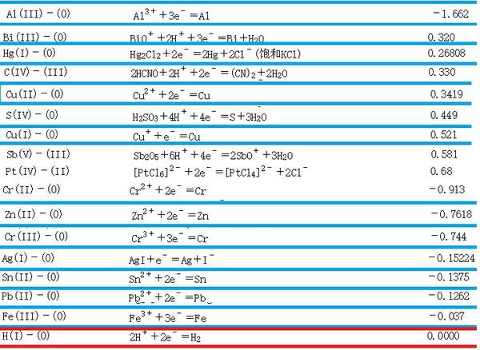
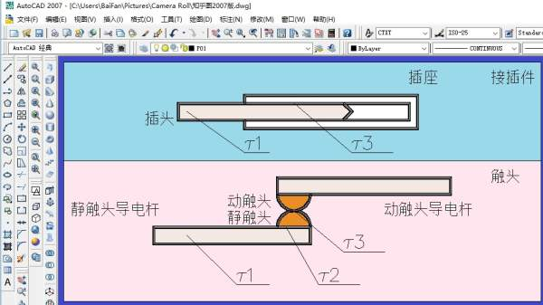

<!--
    author: Patrick Zhang，
    head: none
    date: Thu Mar 23 00:28:00 2017
    title: 为何大多数的插头都是铜镀锡和铜镀银，而较少见到纯铜？
    tags: GitBlog
    category: zhihu
    status: publish
    summary:这个问题看似简单，但它的内涵却很深。我们来探讨一番。首先，要了解插头是什么？插头，在电气技术中叫做接插件，它是机械与电气的联合体，起到连接线路的作用。例如我们的 USB 插头、以太网 RJ45插头、插线板插头，还有供配电断路器的大...
-->

这个问题看似简单，但它的内涵却很深。我们来探讨一番。

首先，要了解插头是什么？插头，在电气技术中叫做接插件，它是机械与电气的联合体，起到连接线路的作用。例如我们的 USB 插头、以太网 RJ45
插头、插线板插头，还有供配电断路器的大电流接插件、高压开关的手车接插件和低压开关柜的抽屉接插件等等。

由于接插件所连接的双方并不一定是同一类用电电器，接插件必须满足标准的外在结构规范，以及电气特性参数和规约。因此，接插件属于电气技术中的标准件。

**我们先看第一个问题：接插件的材料的电阻率**

下图是常用导电材料的电阻率：

接插件的材料一般采用铜基合金。例如纯铜、黄铜、铍青铜等等。材料的表面镀银或者镀锡，甚至镀金。

看下图中 CPU 背面的插针，它是镀金的吗？

从电阻率表中我们看到，导电性最好的是银，其次是铜，再其次是锡。

事实上，接插件是需要一定强度的。而锡和银很软，根本就没法满足接插件的插接强度。所以，接插件的本体都是铜，表面镀锡或者镀银而已。

**第二个问题：接插件镀锡镀银真的仅仅只是为了提高导电性吗？**

当导电材料流过电流后，只要电流的频率不太高，则电流是流过导电材料的整个截面的。即使当频率很高时，材料的趋肤效应也有一定的穿透深度。例如铜在 50
赫兹下的穿透深度是 9.3 毫米。

接插件一般都十分纤细，趋肤效应不是很大，因此电流会流过接插件的整个截面。

我们看下图：

此图中有两种接线端子实物图片，图中上部是弹簧接线端子，图中下部是螺钉接线端子。右图是弹簧接线端子的结构示意图。

从图中我们能明白，插头插入插座后，接触簧片与插头之间是需要有接触压力的，否则就无法实现可靠的接触。对于螺钉接线端子，接触压力来自于螺钉；对于弹簧接线端子，接触压力来自于弹簧。

我们还知道，接插件在工作时，是会产生温升的。温升包括两部分，第一部分是导线温升，第二部分是接触温升。温升的表达式如下：

在这里， τ 是温升，I 是流过导体的电流，Kt 是综合散热系数，S 是导体截面积，M 是导体截面周长， ρ是导体的电阻率，Uj 是接触电压，L
是洛沦兹系数，T 是接触点的温度（单位是 K）。

我们看到，接插件的温升近似与所流过的电流的平方成正比，与接触电压的平方也近似成正比，并且注意到接触电压 Uj 等于接触电阻与电流的乘积。

**由此可见，接插件的接触电阻是多么重要。**

在 GB14048.5-2008《低压开关设备和控制设备 第 5
部分：控制电路电器和开关元件机电式控制电路电器》中，把用于控制的线路定义为辅助回路，而辅助回路的电流一般在 5A 以下。

由此可知，接插件其实分为两种，第一种是 5A 以下小电流的接插件，第二种是 5A 以上的大电流接插件。大电流接插件的电流一般从 10A 到
6300A，例如低压抽屉式断路器（见前面一张图中的 Emax 断路器）的一次回路接插件电流规格就从 1250A 到 6300A。

**对于小电流接插件，它的温升不高，它的重点是提高导电性，降低接触电阻。因此，小电流接插件的插头组件和接触簧片组件镀银的目的就是提高接插件的导电性；**

**对于大电流接插件，它的温升很高，它的重点是降低温升。因此，大电流接插件的插头组件和接触簧片组件镀锡或者镀银的目的就是提高接插件的温升。**

对于大电流接插件，标准中规定，裸铜材料的温升是 60K，镀锡材料的温升是 65K，镀银材料的温升是 70K，具体见
GB14048.1-2012《低压开关设备和控制设备 第 1 部分：总则》的附表。

现在，我们分析题主的问题：

题主问题的注解是：**众所周知铜的导电性比银好，为何所有插头上的铁片不使用铜而使用银？ **

**第一，关于接插件中的铁片。**

看得出来，题主对于工业产品十分陌生，他以为带有弹性的材料就一定是铁片。其实铍青铜的导电性和弹性都远远优于铁片，而黄铜的弹性也很不错，所以接插件中的弹性材料往往不是铁片，而铍青铜和黄铜。

**第二，关于接插件类型。**

题主显然讨论的是小电流接插件。那么结论是，镀银的目的是提高导电性，具体见前面的叙述。

另外题主有一个误区，他以为铜的导电性优于银。结论刚好相反，具体见前面的电阻率表。

最后的结论是什么？

**结论是：电接触其实是有很深的理论的。它涉及到材料、电化学、电气接触和温升理论、发热理论等等。其内容博大精深，涵盖了众多基础理论和工程实践。因此，有关电接触的表述绝不是这个蜻蜓点水帖子能够说明清楚的。**

有关电器的理论有五个，分别是发热理论、电动力理论、电接触理论、电弧理论和电磁系统理论。电接触理论是这五大理论之一。

在国际上有电接触学会，它以电接触的构建者霍姆命名。我国也有相关的学会。

题主的疑问到此应当解答完毕了。但我同时给大家提一些问题：

**第一个问题：如果接插件的插头材料是铜镀锡，接插件的插座接触簧片材料是铜镀银，两者可否长期带电工作？会出现何种现象？如何解决？**

**第二个问题：为何大电流接插件有温升问题？它和接插件材料的机械强度有何关系？如何解决这个问题？**

看到评论区的评论了，大家都根据自己的理解给出了解释。已经到了午休时刻，我来解答吧。

**第一个问题的解答：**

这个问题的解答与化学有关。

我们看下图：

上图（图
1）中，三种基底金属分别是锡、铜和银。三种金属被各自氧化，生成的氧化物分别是：（氧化锡）、（氧化铜）和
 氧化银。

由于空气中难免有水份，于是在水汽的沾染下，出现金属的正离子。金属正离子与金属本体之间的电极电位如下：

我们看到各种不同金属的电极电位分别是：；；。

为何银的电极电位不是 -0.15224V，而是 0.7999V？自己想去（上图中的数据是碘化银）。

我们看到，锡的电极电位最低，银的电极电位最高。由此得知，按金属活动顺序表，锡在铜的左边，因此锡比铜活泼；银在铜的右边，因此铜比银活泼。

于是，铜镀锡后，若镀层不完整，或者镀层有破口，则锡向铜转移电子，锡被氧化，而铜被还原；同理，铜镀银后，若镀层不完整，或者镀层有破口，则铜向银转移电子，铜被氧化，而银被还原。可见，前者是锡被腐蚀，后者是铜被腐蚀。

**如果接插件的插头材料是铜镀锡，接插件的插座接触簧片材料是铜镀银，则可以想见，锡首先被腐蚀，接着铜被腐蚀。随着腐蚀加剧，接触越来越差。严重时插头材料的基底金属铜会因锈蚀而无法工作，甚至断裂。**

看到评论区有评论说，氧化银也会导电。事实上，在这里根本就没有氧化银，只有氧化锡和氧化铜。银已经被还原为金属银了。

这里讲述的原理是氧化还原反应，是中学化学的必学内容。

由此我们得到一个重要结论：不管是插头还是插座，它们的导电材料的表面处理方式应当是一致的：要么都镀锡，要么都镀银。若采用不同的表面处理方式，出现的电化学反应有可能会腐蚀导电材料。

**第二个问题的解答：**

这个问题与金属材料的机械强度随着温度升高而降低有关。

我们来看下图：

就像我在图中注释所说的，铜在连续发热时，才一百多摄氏度铜的机械特性就开始下降了。

此图摘自《金属材料手册》。

**也因此，接插件中非常注意它的工作温度和温升。国家的强制性标准和规范规定，接插件和端子的运行温升绝对不能超过它规定值。**

注意曲线 2，它表征的是铜在受到短路电流瞬时冲击时瞬间发热机械强度下降情况，可见它的机械强度下降程度比运行下要稍微好一些。

我注意到若干评论中谈到了触头的接触问题，并且与接插件相混淆。我把这个问题给澄清一下。我们看下图：

我们先看下图：从图中我们看到，触头系统的温升由 3
部分构成。第一部分是静触头的导电杆部分，也即温升τ1；第二部分是导电杆与触头的连接部分，或者焊接部分，这里的温升是τ2；第三部分是动静触头相接部分的温升，也即τ3。

再看上图，我们看到了插头的温升τ1，看到了插头与插座之间的温升τ3，但没有τ2。

值得注意的是，对于接插件，插头与插座弹性簧片之间的接触点不止一个，因此有多个τ3 共同贡献温升。

我们来看计算τ1 的公式：；

再看计算τ2 的公式：；

我们再看τ3 的公式：

我们不妨通过计算来看看接插件温升与大电流触头温升有何区别：

我们假设两者的环境温度都是 30 度，综合散热系数都是 7。插头导电杆的横截面积是 1 平方毫米，截面周长是 3.54 毫米，假定电流是 1A，接触电压为
10 毫伏，LT 是 8.2X10^(-6)；触头的镀锡导电杆的横截面积是 30X10=300 平方毫米，截面周长是 80 毫米，电流是
630A，接触电压亦为 10 毫伏，LT 也是 8.2X10^(-6)。我们用相同的方法来计算两者的最高温升，尽管接插件其实无需计算中间的温升。

**先计算接插件：**

也就是说，插头和插座组合的最高温升为 4.14K。**我们已经知道环境温度为 30 度，则接插件组合内部的最高温度为 30+4.14=34.14 度。**

**需要说明的是：接插件的接触点不止一个，因此每一个具体的接触点的电流更小，温升也更低。但为了陈述方便起见，此处姑且认为只有一个接触点。**

我们看到，接插件组合的温升并不高，更何况考虑到多点接触后温升更低。

**再看大电流触头温升：**

我们看到，动静触头结合处的温升是 68.7K。

我们来计算各处的温度：**已知环境温度是 30 度，导电杆的温度是 30+54.3=84.3 度，触头与导电杆连接处的温度是 30+67.2=97.2
度，而触头相接处的温度为 30+68.7=98.7 度。**

由 GB14048.1-2012《低压开关设备和控制设备 第 1 部分：总则》的规定，开关电器的环境温度为 40 度时，镀锡导电杆最高温升不得超过
65K。显见，上述导电杆温升仅为 54.3K，完全满足要求。

从这里我们看到，原来导电杆的镀锡与镀银仅仅只影响到它为温升限制值而已，不会对导电能力做出任何贡献。

同时我们也看到，温升的主体是导电杆。也因此，在 GB14048.1-2012
中把导电杆也即开关电器的接线端子的温升作为开关电器的温升限制值。显然，这样规定后既便于测量又便于设计控制，是十分合理的。

**通过对比计算，我们看到了小电流接插件与大电流接插件的根本不同之处：前者镀锡或者镀银用于提高导电能力，而后者则用于提高温升。**

**题主主题的疑问到此全部诠释完毕。**

这个帖子写得太长了，也仰仗于我恰好没什么事。

不过，若知友们能真正理解其中的知识点，我会感到十分欣慰。

**考虑到读我的回答贴的知友大多是大学生，或者新入职的电气工作者，请大家注意这个帖子给我们的提示：我们的知识结构应当是全面的，并且要灵活地掌握所学知识。**

[打开知乎原文](http://daily.zhihu.com/story/9305940)