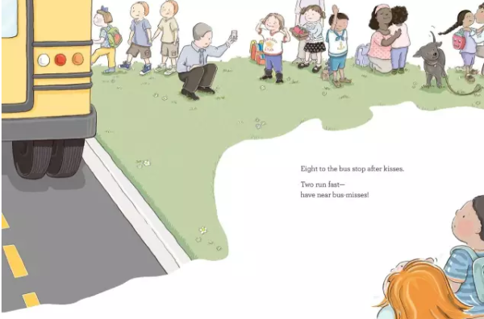
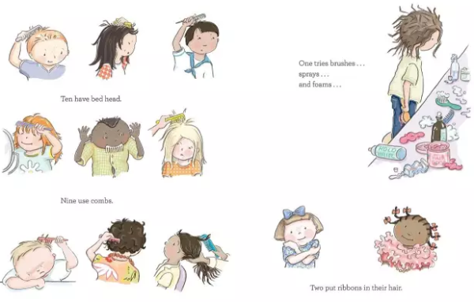
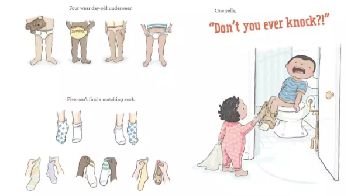
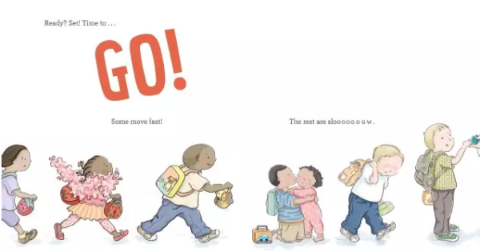

<!--
    author: 萌芽，
    head: none
    date: Thu Mar 23 00:28:41 2017
    title: []
    tags: GitBlog
    category: zhihu
    status: publish
    summary:上幼儿园对孩子来说绝对是一件大事，离开熟悉的环境，到一个陌生的地方，跟陌生的老师同学建立联系，这本身就是一件压力很大的事情。孩子不愿意离开妈妈（爸爸、家人）去上幼儿园（托班）实在是太正常了，换谁都要适应几天的。不过，如果宝宝在开始去...
-->

上幼儿园对孩子来说绝对是一件大事，离开熟悉的环境，到一个陌生的地方，跟陌生的老师同学建立联系，这本身就是一件压力很大的事情。孩子不愿意离开妈妈（爸爸、家人）去上幼儿园（托班）实在是太正常了，换谁都要适应几天的。

不过，如果宝宝在开始去幼儿园的一段时间里，天天哭闹着说不要去，我们首先要排除的是，**孩子是不是在那里跟小朋友或者老师相处的不好？有没有什么让他害怕的东西？以及其他的负面影响。**我家哥哥就有段时间因为害怕被某个孩子欺负，会拒绝去上早教班。如果孩子其实在里面很开心，放学后去接的时候也很好，那我们可以认为是**孩子长大了，认识到分离了**。

机智如我，三年抱俩并且一手带大了两个孩子的我，早就预见到了从来没有离开妈妈超过一天的哥哥，面对分离时的状态，泼、皮、耍、赖，和痛、哭、流、涕，以及脑补了哥哥在新环境里，凄凄惨惨戚戚地盼着妈妈来接的望妈石形象，所以前期的预防工作做的很足，但还是梨花带雨地哭了好多天。

> （插图来自：The Class，By Boni Ashburn，Illustrated by : Kimberly Gee）

我家哥哥三岁整开始送去日托，为幼儿园做过渡。因为托班的学生并不多（我去的时候 3 个老师照顾 1
个孩子），我会更放心孩子面对分离的负面情绪被得到照顾。果不其然，前面的九次送去日托，哥哥每天早上都在哭，傍晚去接的时候，则是开开心心地跑回来找我。

当时的具体做法如下：

_**1**_** 前期让哥哥逐渐习惯"分离"**

在哥哥去上托班之前，我就有意识地让哥哥习惯"分离"，比如会陪他去上早教课，逐渐过渡到让他独立上课。试过陪着上课，哥哥在前面上课我在后面陪着，哥哥在里面上课我在外面陪着，上完课就第一时间出现在门口，逐步过渡到哥哥可以独立上课，上完课以后自己出来找我，给我看在课上完成的"作品"。

就这样，哥哥逐渐适应了自己独立去上早教课，跟老师的互动也很开心，之后我们就开始尝试送托班了。

_**2**_** 坚定地准时送哥哥去上学**

每天早上送哥哥去上学，在门口就把他抱给老师，约定下午几点来接，要确定孩子看到了我的表情，也听到了我说啥。然后跟他微笑挥手说再见，淡定地转身就走了。

不建议在幼儿园门口跟孩子上演分离大戏，已经到了门口，孩子内心其实已经"认命"了，**家长要非常坚定非常淡定，让孩子知道你对于即将发生的事非常笃定。**如果你也犹犹豫豫，孩子可能会更加焦虑，甚至会觉得"不去幼儿园"好像也是可以的。一旦做出决定就要坚定地执行，而不是朝令夕改被迫妥协，**这样孩子知道规则和界限在哪里，才会更有安全感。**

_**3**_** 准时来接，多同他沟通学校的事情**

其实哥哥还是很喜欢托班的，这从他每天傍晚都会笑着跑向我，开心地跟小朋友和老师说再见就看得出来，不过刚开始还是会很不接受"和妈妈分离"这件事。

针对这一情况，每天我都会花多时间，很多次地和他**聊托班里发生的事情，**"今天在托班里都做了什么呀？有没有好玩的事情想要讲给妈妈知道？老师说你在课上表现得很好，妈妈觉得你好棒呀。"让他觉得托班真的很好玩，可以做很多在家里不能做的事情，收获很多家里不能有的收获。

通常这些时候哥哥都会很开心地讲起托班里发生的事情，我也保持倾听并反馈，"其实你很喜欢托班对不对？妈妈真的很希望明天送你去托班的时候，你可以笑着和我说再见，然后亲亲我。"一开始他也都会答应，但是第二天还是哭（还是需要时间来适应）。

> （插图来自 The Class，By Boni Ashburn，Illustrated by : Kimberly Gee）

_**4**_** 晚上花时间梳理他的负面情绪（敲黑板划重点）**

我觉得三岁以下的孩子其实表达能力并不强，**很多时候他的情绪和状况是反映在睡前和睡梦中。**

所以那段时间我带着哥哥弟弟一起睡，睡前和哥哥关灯讲故事，之后会和他专注聊天，聊学校的事情，告诉哥哥明天的行程和课程安排之类的。他有时候会坚决抗拒，不肯睡觉，"因为睡醒了就要去托班了"。

我还是会明确告诉他托班还是会去的，因为哥哥长大了，要学习更多的知识了，妈妈像哥哥那么小的时候，我要去上幼儿园啊，妈妈小时候的幼儿园和哥哥的不一样…（各种扯…哥哥就被故事吸引了，他又忘记了他的拒绝，然后就听着听着睡着了）……

有几天哥哥半夜哭着醒来，说妈妈我不想去托班的。我会抱着他告诉他，重复他的话，比如"你不想去托班，妈妈听到了。你是做梦了么，梦到了什么？"然后他重复几次也会睡下了。

很多时候孩子的负面情绪并不一定需要"终止"上幼儿园才能解决，帮助他疏导，**在跟他相处的时间给他足够的安抚和关注，慢慢地他就能从心理上接受上学这件事了。**此外，小朋友是需要同伴一起玩耍的，他们很快就会交上新朋友，然后乐不思蜀的（期待啊）。

> （插图来自 The Class，By Boni Ashburn，Illustrated by : Kimberly Gee）

就在第十天的时候，当我还是一如既往重复那句话，说要是哥哥明天可以也和妈妈挥手说再见多好，他突然接上了一句，妈妈，我决定了，**我明天要和你说拜拜，然后开开心心去上托班，其实我很喜欢托班。**

当时我虽然表现得很开心，但其实并没有在意，以为他只是说说而已。结果第二天，他就开始彻底接受了托班，很开心地亲亲我，和我说再见。而且，晚上也不再半夜醒来哭着说，妈妈我不想去托班了。后来去托班情况都很好。

> （插图来自 The Class，By Boni Ashburn，Illustrated by : Kimberly Gee）

最后，我个人觉得引导宝宝面对入园焦虑其实并没有什么特别的技巧，因为有些时候**孩子的行为是一个水满则溢的过程**，他从家长这边吸收到的态度和观点，会不断潜移默化地影响自己的行为。作为家长，我们要做的其实是做好准备、坚决执行，同时对孩子的状态保持知觉并及时反馈，相信他们有能力自己平稳度过这一段焦虑的时光。

愿每个孩子都能享受在幼儿园的欢乐时光。

[查看知乎原文](http://zhuanlan.zhihu.com/p/25727053)

[打开知乎原文](http://daily.zhihu.com/story/9305960)