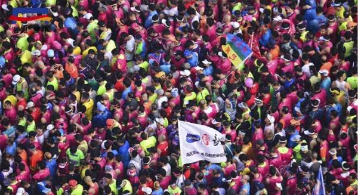
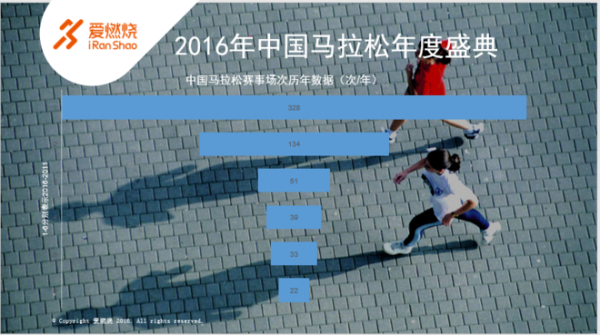
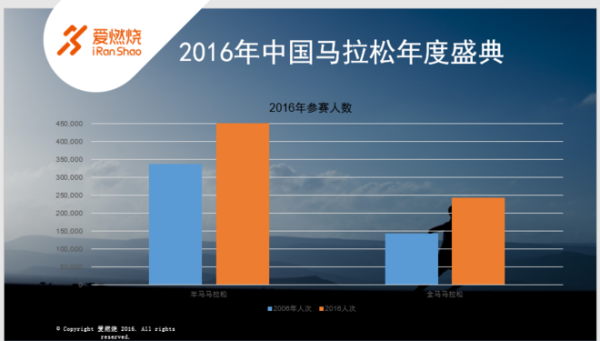
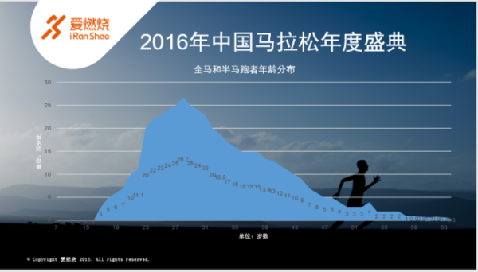
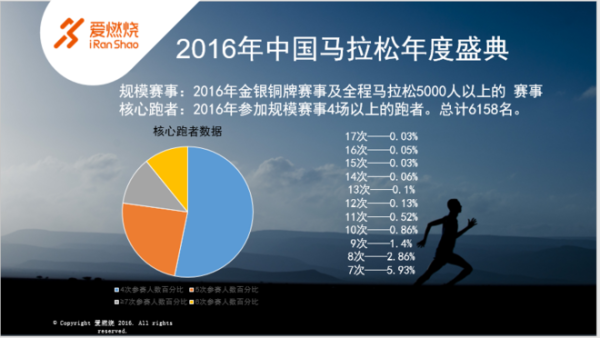
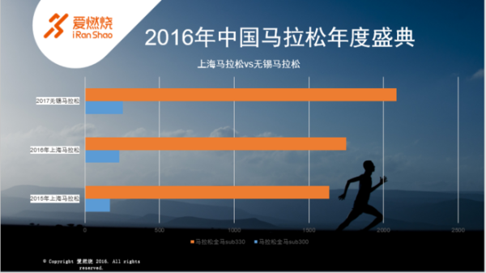
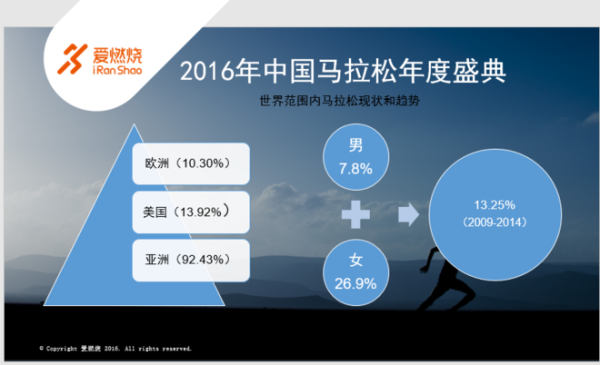

<!--
    author: 爱燃烧，
    head: none
    date: Thu Mar 23 00:26:42 2017
    title: 2016 中国马拉松年会解读：马拉松那么多跑者够用么？
    tags: GitBlog
    category: zhihu
    status: publish
    summary:文章来自[机构帐号](https://www.zhihu.com/org-intro)：[爱燃烧](https://www.zhihu.com/org/ai-ran-shao-46/activities)* * *> 2016...
-->

文章来自[机构帐号](https://www.zhihu.com/org-intro)：[爱燃烧](https://www.zhihu.com/org
/ai-ran-shao-46/activities)

* * *

> 2016 年多少人跑完全马半马，不仅非洲兄弟不够用了，中国跑者也要不够用了。

在刚刚过去的上一周，跑者的微信中可能都流传着一个 3 月 18 日以及 3 月 19 日的马拉松列表，随着三月的到来，跑步比赛也在 2017
年迎来了第一个高潮。而无锡马拉松的终点前跑错，兰溪马拉松的紧急 AED 救援也迅速在社交媒体传播，成为热点话题。马拉松也依然保持着火热的疯狂的增长势头。

在前天召开的 2016 中国马拉松年会上，诸多 2016 年的马拉松大数据公开，同时也公布了许多重磅内容。

****参赛人数以及赛事数量疯狂增长****

2016 年究竟有多少场比赛呢，年会上公布的数据为 328 场（2015 年 134 场），这 300
多场是在中国田联注册的赛事。而实际根据爱燃烧的统计，2016 年跑步赛事以及活动为 1372 场，也就是平均一年每个周末有 26
场比赛举行。全中国的跑步比赛数量正在疯狂地增长。

这么多的比赛，有多少人在跑呢，年会给出的数据为 280 万人次，不过这个数值也包括了马拉松比赛中的迷你组，健康跑等。但相比于 2015 年的 150
万人次参与数，依然是一个井喷式的增长，也说明了很多人在 2016 年完成了从不跑步到跑步的第一步。

在 2016 年，**142210 人（24 万多人次 ）完成全程马拉松，337484 人（45 万多人次）完成半程马拉松**。用 280
万人次做一个算术：有约 210 万人次参加的是短于半程马拉松距离的跑步活动或未完赛（280-45-24）。我们得到这样的一个猜想：这个**超过 75% 的
210 万非全马半马参与（以及全马半马未完赛）人次**，是由 2016 年高达 144% 增长速度的赛事带来的。

24 - 29 岁的人群，成为跑半马和全马的最大人群，达 26.7%。与西方发达国家不同，中国的跑者更加的年轻化。

****你是核心跑者么？跑者能力在进步****

马拉松大数据报告对核心跑者的定义为：参加规模赛事 4 场以上的跑者，而规模赛事为 2016 年的金银铜牌赛事及全程马拉松 5000
人以上的赛事。据统计，2016 年的核心跑者人数为 6158 名，而最多参与次数居然是 17
场，而发布人也发出了"**跑步上瘾，量力而行，适度为宜**"的呼吁。究竟是真的跑步上瘾还是为了达到一个参加马拉松的量化成就呢，我们不得而知。

3 月份也并不是马拉松举行最多的月份，去年田联注册比赛举办次数最多的月份是 10 月份，多达 58
场，除去十一黄金周的少数比赛，十月的后三个周末每个周末都挤满了各种比赛。气候是举办比赛的关键。

我们也把刚刚出炉的 2017 年无锡马拉松成绩和前两年的上海马拉松进行了对比，可以看出，越来越多的跑者能力在增强，"严肃跑者"越来越多。

**2015 上海马拉松全马 sub3 的人数为 167 人，2016 上海马拉松为 231 人，2017 无锡马拉松为 252 人。**

**2015 上海马拉松全马跑进 330 的人数为 1634 人。2016 上海马拉松为 1750 人，2017 无锡马拉松为 2086 人。**

****发达国家马拉松的衰落****

国际田联路跑主管 Alessio Punzi 在年会上发布了马拉松发展现状与未来趋势的报告，从全球的角度介绍马拉松目前的发展。

（各大洲跑步人口增长百分比以及男女增长百分比）

我们国家是不是全世界跑步发展速度最快的国家呢，答案居然是否定的。跑步人口增长最快的是俄罗斯，增长率达到 300%，但这个数据是 2009 - 2014
年的统计结果，而真正的中国马拉松井喷是在 2015 以及 2016 年两年，所以可能中国目前已经成为世界上跑步人数增长最快速的国家。

同时我们也可以发现，亚洲跑步人口增长很大，但一些欧洲的发达国家，跑步的人数不增反降（马拉松的数量也开始趋于平稳），跑步这么有意思他们怎么不继续跑了呢，大概他们找到了更有趣的活动：更加刺激多样的更贴近自然的户外运动以及更加时髦的室内运动。

****全球马拉松的未来发展趋势****

一，2016 年全球马拉松赛事依然在增长（有发展中国家助力）。

二， 大规模的马拉松变得更大，中型马拉松开始缩水，而小型马拉松如果没有政府支持已经开始消失。

三，半马是全世界最受欢迎的项目。

四，越来越多的跑者开始进行新的跑步行为（趣味跑，越野跑等）。

五，拉丁美洲以及亚洲，女性跑者还有很大的发展空间。

****其他亮点****

年会上还发布了其他一些有亮点的信息，比如设立将会中国马拉松大满贯，但还没有确定哪些比赛。

发布大众跑者参加 2020 年东京奥运会马拉松的参与方法，会有一男一女大众跑者代表中国参加奥运会。我们也期待中国能出现一个最强马拉松公务员（也可能是城管）。

关于去年的两大负面话题，替跑和猝死。田协也推出了相应的方案：首次违反，终身禁止参加该赛事，二次违反终身禁止参加田协所有赛事。

****疯狂市场，理性选择****

马拉松可能已经在中国变成一项流行的活动，这其中最大的原因可能不是你对跑步的坚持，而是马拉松市场（赛事公司，地方政府，赞助商）的疯狂投入。

但我们跑者要顺从市场做一个疯狂的马拉松赛事追随者么？把自己生活的重心移到跑步，先不说自身能否承受的了，家庭事业也会受到影响。而经常发生在半程马拉松的猝死事件也为初跑者敲响了警钟：科学跑步，合理参加比赛活动，把马拉松放在生活的合适位置。

让马拉松变成生活的甜品而不是毒品。

* * *

「知乎机构帐号」是机构用户专用的知乎帐号，与知乎社区内原有的个人帐号独立并行，其使用者为有正规资质的组织机构，包括但不限于科研院所、公益组织、政府机关、媒体、企业等。这不仅是知乎对机构的「身份认证」，更是涵盖了内容流通机制、帐号规范等全套帐号体系。和个人帐号一样，机构帐号开通不需要任何费用，同时也受社区规范的监督管理，并要遵守相关协议。目前机构帐号入驻采用邀请制。您可以通过
[什么是「知乎机构帐号」](http://zhihu.com/org-intro) 来了解更多机构帐号信息。

[查看知乎原文](http://zhuanlan.zhihu.com/p/25910545)

[打开知乎原文](http://daily.zhihu.com/story/9306748)