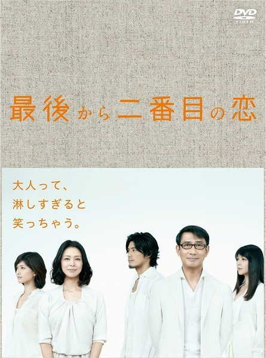
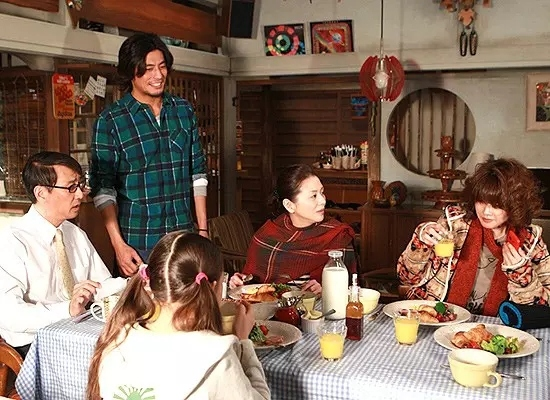
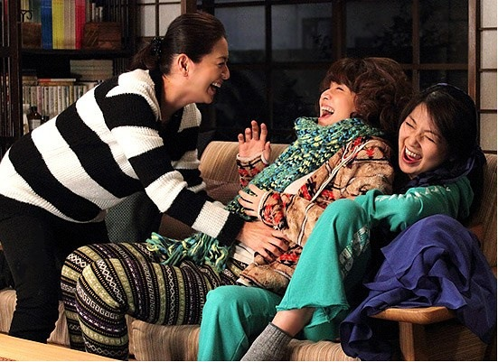

<!--
    author: 王RRR，
    head: none
    date: Thu Mar 23 00:25:03 2017
    title: []
    tags: GitBlog
    category: zhihu
    status: publish
    summary:冬天出差时断断续续地看完了《东京女子图鉴》，当时未曾料想到在中国这部剧能够成为"现象级"的热门话题，毕竟只是每集时长 20分钟左右的网络剧，主演也算不上是一线卡司，大概是激起了漂在繁华都市的异乡人的共鸣吧，这个群体的规模大得惊人，背井...
-->

冬天出差时断断续续地看完了《东京女子图鉴》，当时未曾料想到在中国这部剧能够成为"现象级"的热门话题，毕竟只是每集时长 20
分钟左右的网络剧，主演也算不上是一线卡司，大概是激起了漂在繁华都市的异乡人的共鸣吧，这个群体的规模大得惊人，背井离乡在北上广深等一二线城市打拼，而他们其中的一部分，却连谈论房价的资格都没有，每个月银行卡上涌入的单薄数字，无法构建起理想或者未来。

不过日剧中的人生观丰富且细腻，同样是以拼搏在东京的大龄单身女性为主角的电视剧，我倒是更喜欢[《倒数第二次恋爱》](http://link.zhihu.com/?target=https%3A//movie.douban.com/subject/6989744/)（2012
年），一方面是对于小泉今日子爱慕有加，另一方面则是喜欢剧中传达出的态度。

年少时觉得自己与众不同，有与全世界为敌的勇气，回头看看，那些信誓旦旦的许诺都是浅薄无力的青春期呓语。最终我们都成为了面目模糊的大人，甚至在某一时刻，对自己都憎恶至极。没有不寂寞的大人，我们无法改变生活的残酷面目，只能努力地保持从容。小泉今日子饰演的吉野千明虽然已经年过四十，却仍怀有对爱情的渴望和对生活的热诚，这样的态度值得拥有奇妙的际遇。

人啊，想要活得不那么痛苦，就得想清楚自己究竟想过什么样的人生，并且衡量其可实现的几率。小泉今日子饰演的吉野千明，45
岁，在电视台担任制片人，她拥有一份难得的清醒，纵使孑然一身，却笃定、冷静。《东京女子图鉴》主人公的终极理想其实说白了就是被纸醉金迷的"湾区"接纳，然而千明则厌倦光怪陆离的城市，几乎花光了所有积蓄在镰仓买下一所旧宅，也因此结识了可爱的邻居们。人终究会孤独地老去，东京的灯红酒绿看似热闹，实则冰冷，而镰仓则还拥有世俗烟火的气息。在这座临海的小城，千明邂逅了一场恋爱，虽然剧名已经暗示了这场恋爱的结局，但实际上这部剧其实算不上是一部纯粹的恋爱剧，谈得更多的其实是如何认真生活，如何与自己相处。就算已经
45
岁又怎样，不能因为年龄大就被剥夺恋爱的权利。就算这份感情无法修成正果，也相信这是人生倒数第二次恋爱，还要心怀期待，而不是纠结此前的过往。《东京女子图鉴》中呈现出来的感情观之所以不动人就是因为主人公的目的性过强，或者与同乡抱团取暖，或是将目标锁定商场精英，就连结婚都似乎都是迁就之后的结果，而《倒数第二次恋爱》中所表达出的精神内涵则没有那么浮躁----

> 所谓人生 就是去和自己的未来恋爱  
> 爱上自己的未来 一定能有乐趣地生活  
> 我也不想一个人  
> 如果未来爱上一个人  
> 也不要想着那是人生最后一次恋爱  
> 那应该是倒数第二次的恋爱  
> 那样你才能拥有有情调的人生

不得不说编剧冈田惠和功力十足，前几日猛然发现小时候就看过他的剧《轻轻紧握你的手》，剧情已经记得不是非常清楚了，但当时窝在 21
寸熊猫牌电视机前哭成狗的情景还是印象深刻的。诚如前文所说，虽然这部剧的剧名是《倒数第二次恋爱》，但除了爱情之外，剧中还有空间容纳了友情和亲情，精巧且有趣。而于我而言，小泉今日子的魅力就足以吸引我看完全剧，内田有纪的出现则是让我惊喜，少年时期的内田有纪英气潇洒，但我更喜欢她
30 岁之后软绵绵的样子。而剧中最有趣的一个角色，则是中井贵一饰演的大哥，这个人物设定太过平实----50 岁的小公务员----
看似温吞的性格，其实细腻得很。好的演员一定不会用力过猛，所以我们才能沉浸在故事之中，看这几位内心温暖的活宝聚在一起相互取暖，让人感觉熨帖、踏实。

[查看知乎原文](http://zhuanlan.zhihu.com/p/25866950)

[打开知乎原文](http://daily.zhihu.com/story/9306934)