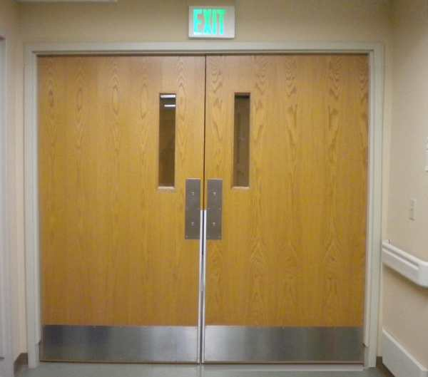
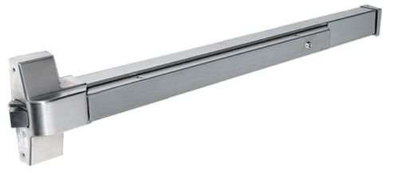
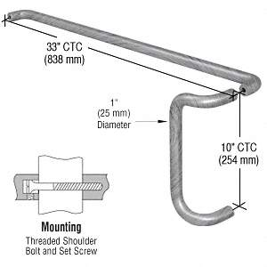

<!--
    author: 猪小宝，
    head: none
    date: Thu Mar 23 00:27:18 2017
    title: 横推竖拉的门把手设计是如何在美国成为主流的？
    tags: GitBlog
    category: zhihu
    status: publish
    summary:建筑设计的一个基本原则，门的开合方向，是要匹配紧急逃生路线的。比如题目里这张照片：门上方有标有 EXIT的应急照明，说明这道门是逃生路线的一部分，紧急情况下，没有其它照明，大家只...
-->

建筑设计的一个基本原则，门的开合方向，是要匹配紧急逃生路线的。

比如题目里这张照片：

门上方有标有 EXIT
的应急照明，说明这道门是逃生路线的一部分，紧急情况下，没有其它照明，大家只能按照这个标明出口的应急指示灯，跑到这扇门前，继而通过这扇门，疏散到安全区域。

因此，这扇门必须是往外推的，而不能是往里拉的。

原因很简单，如果是往里拉，紧急情况下大家一窝蜂的涌到门前，排在第一个的人很可能被后面的人群不停的往前推，无法做出往里拉门的动作。后面的人不知道前面的情况，还一直往前挤，很可能会导致大家越挤越乱，最终堵死在门口，甚至会造成踩踏事故。只有把门设计成往外推的，无需停留，人群自然而然的就能把门推开。

所以，如果大家仔细观察的话，大多数公共场合的外门都是向室外的方向开合。也就是说，从室内到室外，只需要推门即可；从室外到室内，需要拉门。这就是为了方便紧急情况下大家能顺利的从室内疏散到室外。

同样的道理，这样往外推的门，如果需要设置一个锁止装置，但是同时又希望紧急情况下能迅速打开的话，显然是这个锁止装置的开关越大越好，越容易触发越好。

这就是题目里这种门锁的作用。一个大长条，接触面积特别大，门有多宽这把手就有多宽，根本不需要去找开关在哪里，甚至不需要手的操作，也不需要刻意的去做开锁的动作，只需要身体往前一冲，就能开锁。如果不这样设计，反而设计成公寓防盗门那种复杂的开锁操作，那么紧急情况下人群可能来不及思考，也可能因为紧张导致无法思考，很难找到门锁开关在哪里，或者很难迅速打开复杂的锁止装置，很可能耽误宝贵的逃生时间。

既然这些门都必须设计成往外推的，那么自然，另一面就得设计成拉的。所以另一面一般会设计一个门把手，方便开门。这种拉门的情况就无需考虑紧急疏散的要求，所以拉门的把手可以做成各种好看的造型。一般来说，操作方便的话，竖向的拉手对于大多数人来说，可能更顺手一些。

这也就是这种拉手的设计。推门那一侧是横向的，无需用手，身体往上一靠即可，紧急疏散的时候很容易被人群冲开；拉门的那一侧是竖向的，视觉上引导大家拉门把手，而且手腕也舒服一点。

[打开知乎原文](http://daily.zhihu.com/story/9306992)