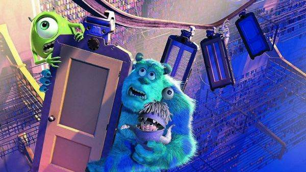
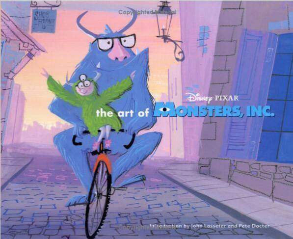
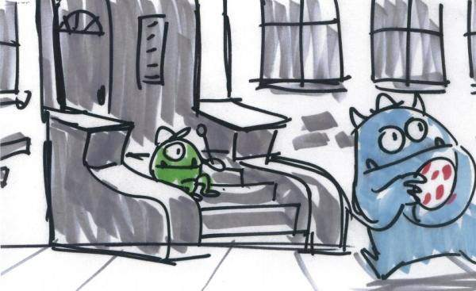
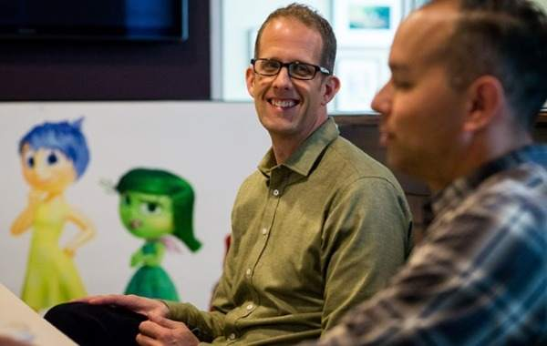

<!--
    author: 水5郎 waterfive，
    head: none
    date: Thu Mar 23 00:26:52 2017
    title: 如何看待外媒报道《疯狂动物城》涉嫌抄袭加里·戈德曼的《动物乌托邦》？
    tags: GitBlog
    category: zhihu
    status: publish
    summary:其实专业的电影公司和电影公司的制片人，是从来不收你直接冷不丁交递的剧本的，比如邮寄到公司前台，公司会原封不动还给你。这种都叫 cold call。他们只收agency 的，为什么呢？因为怕被告啊！万一内容撞车被告抄袭呢？（因为成熟的好...
-->

其实专业的电影公司和电影公司的制片人，是从来不收你直接冷不丁交递的剧本的，比如邮寄到公司前台，公司会原封不动还给你。这种都叫 cold call。他们只收
agency 的，为什么呢？因为怕被告啊！万一内容撞车被告抄袭呢？（因为成熟的好剧本概率真的很低，犯不着这个风险）

我的制片人朋友最怕的是微信加了不认识的编剧，人家突然啪叽丢过来一个剧本……吓得她赶紧说您退回去！就怕创意撞车然后被人告。

其实《疯狂动物城》被告不是新鲜事了。之前 PIXAR
的《怪物公司》已经发生过这样的事情了，然后其实这个作者还不够机智，告《怪物公司》的作者可是直接在影片上映前提出开听证会，并且发出了终极武器----**"上映禁止令"**，直接把导演和迪士尼吓得要哭了。

具体故事我之前在**[上映 15 周年纪念：《怪物公司》背后的创作故事 \-
知乎专栏](https://zhuanlan.zhihu.com/p/23375000)**里面写过，非常跌宕起伏！全文见里面。我只摘抄打官司的那段哈，有兴趣看全部幕后可以打开连接

**创作小心！一言不合就被告**

罗瑞*玛德丽（Lori Madrid）是一个作家，平时工作是给儿童写儿歌和故事。把自己的有一天她正在家工作，突然收到朋友的电话：

> "哎呦！！！你快去看皮克斯最新的电影预告片！你的作品被抄袭了！！！"

玛德丽赶紧去看，果真如此！《怪物公司》创意和她曾经写的一首诗歌《我的衣橱里有个男孩》（There`s a Boy in My
Closet）几乎一样。《我的衣橱里有个男孩》讲述的是一个胆小的小怪兽坚称在自己的衣橱里看到了一个小男孩，但是小怪兽的妈妈告诉他根本不可能有这么回事。

虽然创意撞车但是为什么玛德丽觉得是皮克斯抄袭了自己？因为在创作这首诗歌后她曾改编了一个小故事，然后投稿给了好几家出版社，虽然都鸟无音讯，但是最后有一家音乐剧公司买走并改编成音乐剧。然后《怪物公司》的画集是由她曾经投稿的同一家出版社出版，**所以她坚定的认为这不是偶然，肯定是出版社的人偷偷把创意给了皮克斯！**

虽然玛德丽的被害妄想其实颇站不住墙脚，大公司接受稿件和剧本都通过文学经纪公司，一个默默无闻的作者的作品基本连送都送不到他们手里，更别提仅仅靠这个创意就直接去做一个投资数亿的电影。何况皮克斯只是通过同一个出版社出版了画集！？

然而虽然看起来有点胡搅蛮缠，但是玛德丽拥有一个极为可怕的法律武器：**"上映审前禁止令。"**就是可以要求法庭暂停《怪物公司》的上映，并且玛德丽的律师非常鸡贼的选择上映前一天进行禁止令的听证会，如果法庭和陪审团认同玛德丽的说法，那《怪物公司》就会被暂停上映！然而物料和宣发早已铺满了全美院线，皮克斯和迪士尼的心血将要损失惨重！

皮特颤抖着坐在听证会的席位上，因为律师也说只要一旦开庭，任何情况都无法保证。玛德丽的律师有权要求检视皮克斯在创作《怪物公司》时候的所有往来邮件和设定，谁都保不齐员工之间的某句话会成为对方的武器，因为可是整整有几百人耶！

> 法官询问皮特的工作："这部电影让你努力了多久？""5 年，我们有 450 个工作人员参与了这部电影"

在问询环节里迪士尼总裁也补充，为了电影上映，仅仅首映会和特别放映会就让迪士尼花费了 3500 万美金，5800
多份胶卷已经运输向全美各大电影院。皮特不断的和法官说这部作品的上映是多么的重要，做电影就像播种、施肥、收获，一旦错过收获果子就会烂在地里，永远会错失掉。

**法官裁定是否发布禁止令的依据是：**

> 1、如果电影上映，原告玛德丽是否会受到无可弥补的伤害。 2、她是否有极大的获胜机会？ 3、让电影发行对她造成的伤害是否会超过对迪士尼和皮克斯的伤害。
4、最后，禁止令是否违背公众利益？

最终，法官和陪审团裁定驳回玛德丽的禁止令要求，并且逐一解释为什么偏向迪士尼和皮克斯让电影如期上映，法国甚至最后开玩笑到：

> "我的书记员有两个侄女，一个 2 岁一个 7 岁，等待这部电影已经很久了，如果我发出禁止令，全国的小孩都会非常生气和失望认为我是一个大怪兽。"

最终《怪物公司》如期上映，取代了《玩具总动员 2》成为了史上票房第二高的动画电影，仅次于迪士尼的《狮子王》。然而官司还是要继续，玛德丽要求皮克斯提供了整整
100
多箱故事创作的材料。但是最后，法院驳回了玛德丽的起诉，裁决《怪物公司》除了常见的想法和创意，与玛德丽的诗歌完全没有关系，著作权法并不保护这些常见的主题和想法。如果著作权法保护这些东西，那将会阻碍创意的流通。

玛德丽案告一段落，然而《怪物公司》随后又接到了好几次作家与画家的诉讼，比如有一个画家认定毛怪和大眼仔的设定和他之前的画的一模一样，并且他曾把画给拉塞特的朋友看过，因此拉塞特间接看到了他的作品，所以认定皮克斯抄袭了自己的创意。（虽然拉塞特的朋友在法庭上说并没有给拉塞特看过）。

究竟创意和艺术的保护边界在哪里？如何才能保护创意的同时不影响创造力？大公司和个人该如何保护自己的权益？知识产权的复杂之处就在每经过一个大脑，性质就发生了变化。

**皮特在完成《怪物公司》后说了这样一段话：**

>
"创作就像你跑进了伸手不见五指的隧道，你相信某个地方一定有终点可以去那里出去，但是在旅途中你周围一片漆黑看不到任何东西，并且伴随着前进，你进来的入口处的光亮已经看不见了，但是你始终找不到出口，你能做的就是一起向前跑！最后，你看到了前方一丝光亮，然后这光芒越来越多，你不停的向前跑，最后在某一时刻，你又重新站在了太阳之下！！"

参考资料

《Pixar Touch》

《Creativity,inc》

《To Infinity And Beyond : The Stroy Of Pixar Animation Studios》

[打开知乎原文](http://daily.zhihu.com/story/9307467)